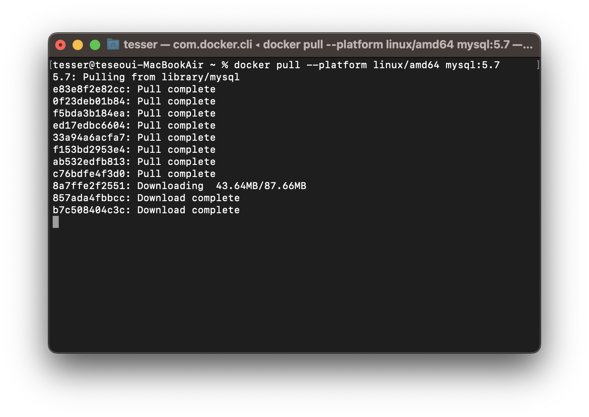
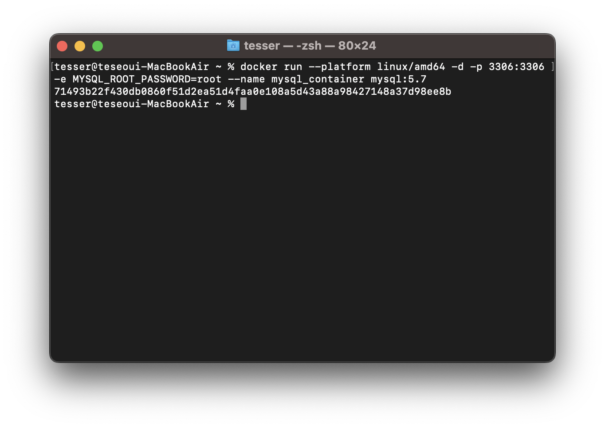
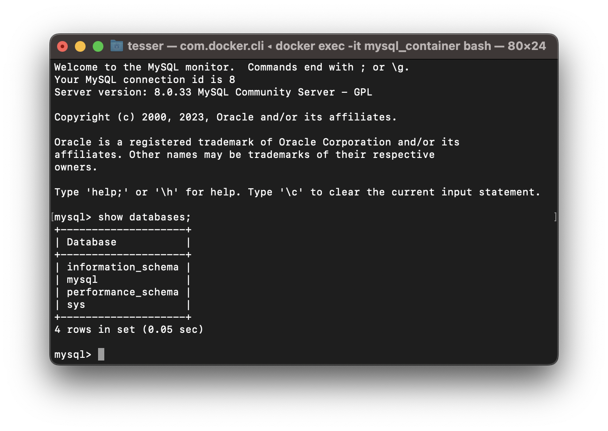
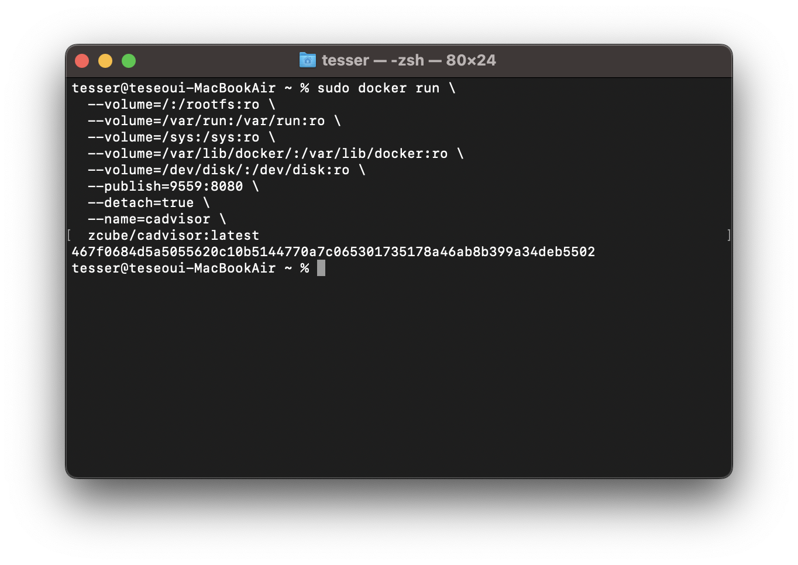
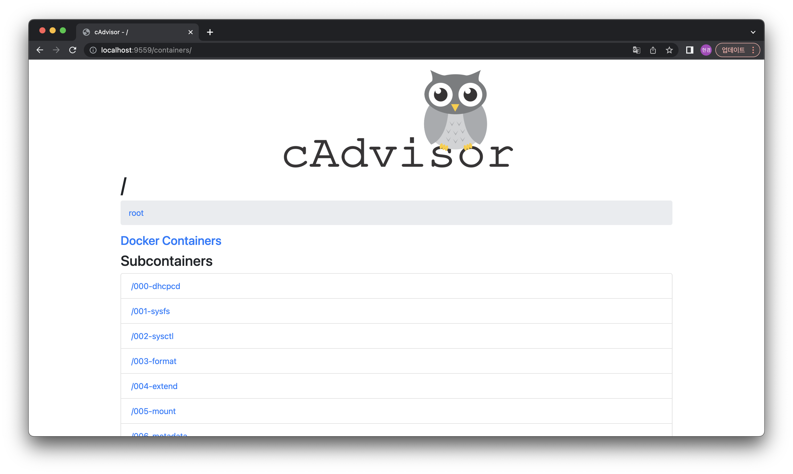
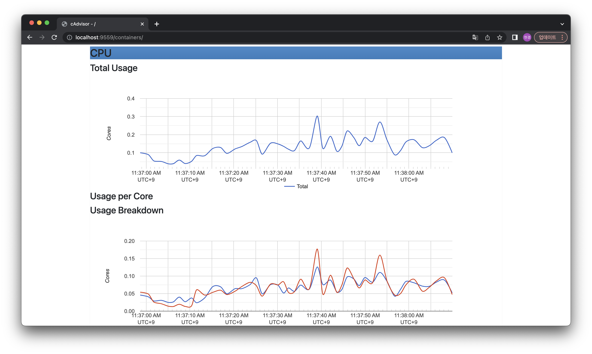
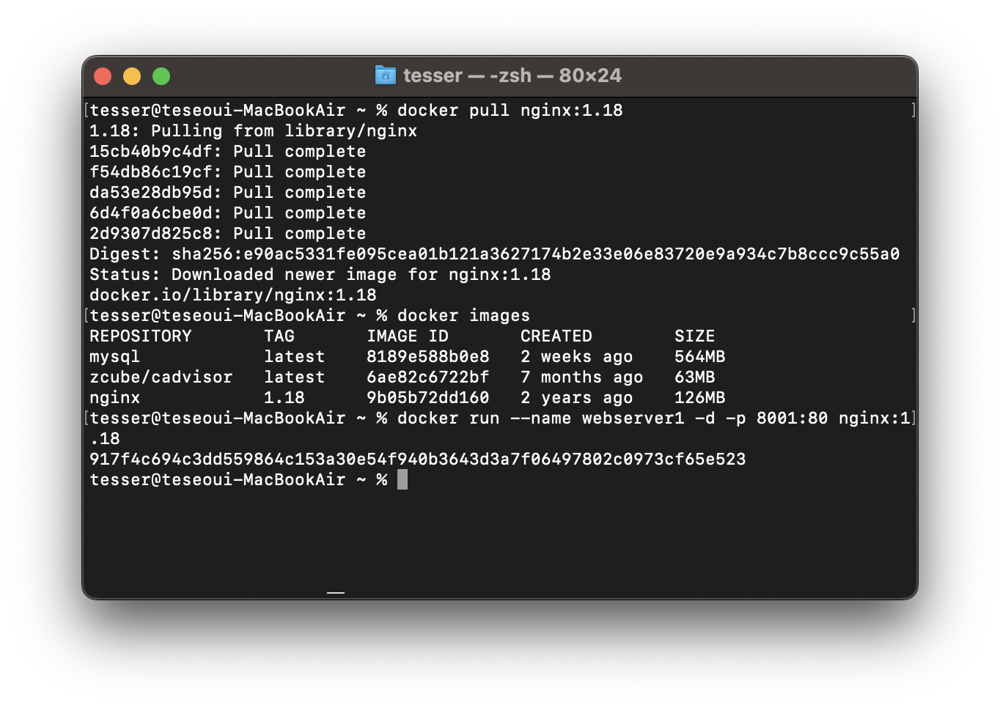
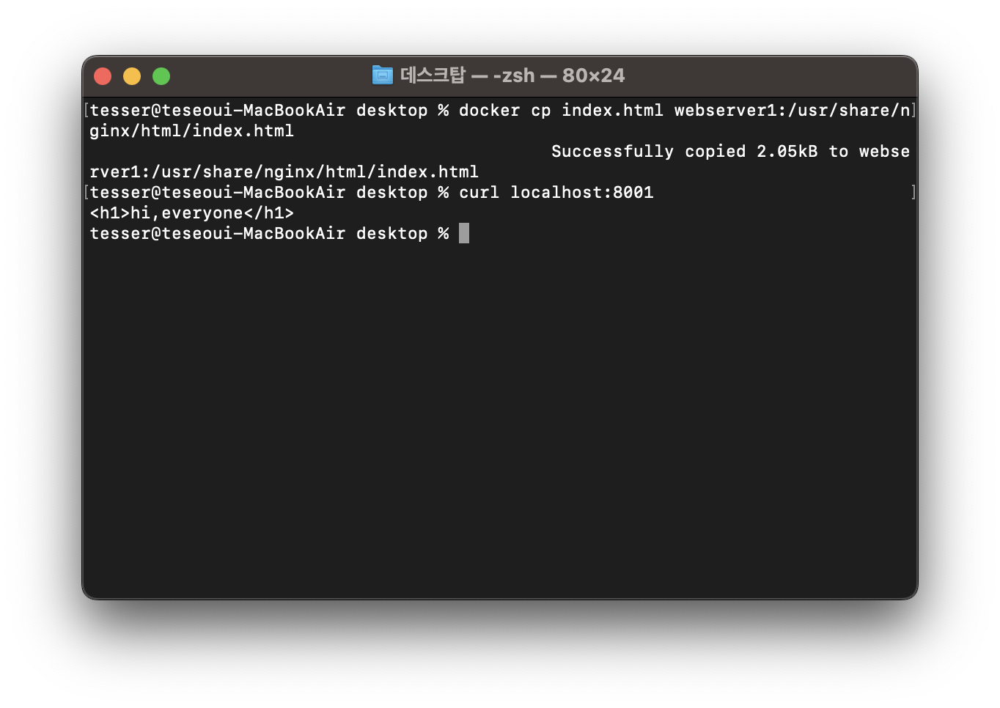
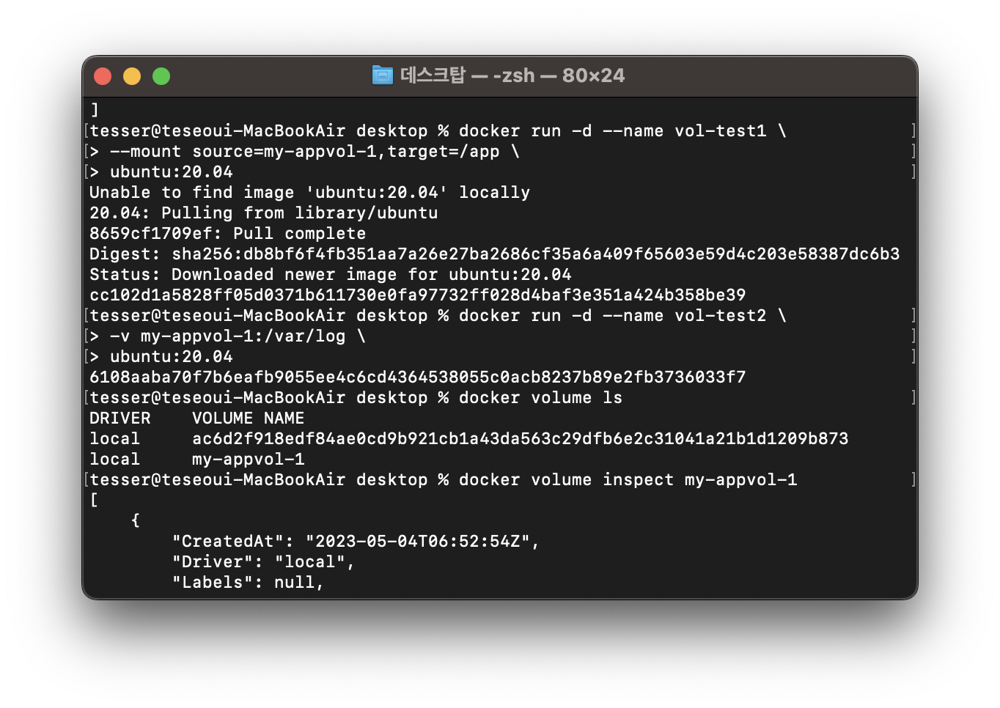

# 도커 스터디

# 실습

## 3-1 MySQL 컨테이너 실행

```bash
$ docker pull --platform linux/amd64 mysql:5.7 
```



```bash
$ docker run --platform linux/amd64 -d -p 3306:3306 \
-e MYSQL_ROOT_PASSWORD=root --name mysql _container mysql:5.7
```





## 3-2 컨테이너 모니터링 도구 cAdviosr 컨테이너 실행

```bash
sudo docker run \
  --volume=/:/rootfs:ro \
  --volume=/var/run:/var/run:ro \
  --volume=/sys:/sys:ro \
  --volume=/var/lib/docker/:/var/lib/docker:ro \
  --volume=/dev/disk/:/dev/disk:ro \
  --publish=9559:8080 \
  --detach=true \
  --name=cadvisor \
  zcube/cadvisor:latest
```







## 3-3 Nginx 컨테이너 실행



### nginx index.html 파일 수정(copy 방식)

 

```bash
docker cp index.html webserver1:/usr/share/nginx/html/index.html
```




## 3-6 도커 볼륨 활용

- 마운트

```bash
docker run -d --name vol-test1 \
> --mount source=my-appvol-1,target=/app \
> ubuntu:20.04
```


- 볼륨

```bash
docker run -d --name vol-test2 \
> -v my-appvol-1:/var/log \
> ubuntu:20.04
```



바인드 마운트 vs 볼륨 

- 볼륨은 도커 영역안에서 관리된다.
- 바인드 마운트의 경우 외부(host)에서 컨테이너 안쪽으로 내용을 추가할 수 있지만 볼륨은 그렇지 않다.