# 3장 컨테이너 서비스를 위한 도커 활용

# 주요 개념

### **가상머신 vs 도커**


먼저 도커의 가상화 기술인 컨테이너를 알기 위해서는 가상 머신 기술에 대해 먼저 알 필요가 있습니다. 가상머신은 컴퓨터의 물리적 요소인 하드웨어를 가상화(\*가상화란 하드웨어에서 기능을 분리하는 기술을 말합니다)하여 컴퓨팅 리소스(컴퓨팅, 스토리지, 네트워크)를 분리하여 사용할 수 있도록 합니다. VM에서는 하이퍼바이저가 해당 리소스 분리를 담당합니다. 즉, 호스트 OS 위에서 하이퍼바이저(Hypervisor)가 게스트 OS를 실행하고 각 게스트 OS는 가상 하드웨어에 대해 완전히 독립된 컨트롤을 가지며 호스트 OS와 완전히 분리되어 동작합니다. VM 방식은 하나의 물리적 컴퓨터에서 여러 운영 체제 환경을 실행할 수 있다는 장점이 있지만 각 VM마다 필요한 운영체제와 라이브러리를 모두 가지고 있기 때문에 용량이 크고 배포 및 관리가 복잡합니다.

반면, 도커는 호스트 OS 위에 도커 엔진이 설치되고 GuestOS 없이 호스트 OS 커널을 공유하여 호스트 OS 위에서 실행됩니다. 즉, 가상 머신은 호스트 운영 체제 위에서 독립적인 운영 체제를 실행하므로 각각의 가상 머신은 자체적인 운영 체제 이미지와 시스템 리소스를 필요로 하지만 도커는 호스트 운영 체제의 리소스를 공유하여 실행됩니다. 도커 컨테이너는 호스트 운영 체제와 동일한 커널을 공유하므로 가상 머신처럼 완전한 운영 체제를 가지지 않습니다. 이로 인해 도커 컨테이너는 가상 머신보다 더 적은 용량을 차지하고 시작되는 시간도 빠릅니다. 또한 도커 컨테이너는 호스트 운영 체제와 커널을 공유한다고 하더라도 네임스페이스(namespace) 와 cgroups(control groups)기능을 통해 격리된 환경을 제공하여 VM과 같이 독립적인 공간을 생성합니다. 네임스페이스와 cgroup에 대해서는밑에서 다루도록 하겠습니다.

결론적으로 도커 컨테이너는 GuestOS가 따로 필요하지 않고 호스트 OS와 커널을 공유하여 실행되므로 VM보다 가볍고 VM의 독립된 환경과 같이 각 컨테이너 또한 독립된 환경으로 구성됩니다.

### **도커 이미지 레이어**

도커 이미지는 레이어(layer)로 구성되어 있습니다. docker pull 명령어를 통해 아래와 같이 여러 digest(레이어 데이터를 해시한 결과)가 보이고 각각 다운로드 되는 것을 확인할 수 있습니다.


도커는 레이어 방식을 사용하기 위해 **유니온 파일 시스템**(UnionFS)을 활용합니다.


유니온 파일 시스템(UFS)이란 여러 개의 파일 시스템을 하나의 파일 시스템에 마운트 하는 기능을 말합니다. 즉, 각 레이어는 이전 레이어(read only)를 기반으로하여 Writable 레이어을 스택처럼 쌓아서(합쳐서) 최종적인 파일 시스템을 구성하게 됩니다.


도커 이미지는 기존 레이어는 그대로 둔 채 새로 업데이트된 내용만 담고 있는 레이어만 쌓는 UFS의 CoW(Copy on Write) 전략을 사용합니다. 도커에서는 레이어가 크게 컨테이너 레이어(상위)와 이미지 레이어(하위)로 구분됩니다. **기존의 읽기 전용 이미지 레이어(하위) 위에 읽기/쓰기 전용 레이어(상위)를 추가합니다.** 이미지 레이어를 그대로 불변의 레이어로 사용하면서, 컨테이너가 애플리케이션 실행 중에 생성하는 모든 파일이나 변경사항은 R/W layer에 저장되므로 여러 개의 컨테이너를 실행하면서 이미지는 불변성을 유지할 수 있습니다.

이렇게 레이어 방식으로 도커 이미지를 관리하면 다음과 같은 장점을 얻을 수 있습니다.

1. 효율적인 이미지 관리: 도커 레이어를 사용하면 각 이미지 레이어를 개별적으로 관리할 수 있습니다. 이전에 빌드한 이미지의 레이어를 재사용하여 새로운 이미지를 더 빠르게 구축할 수 있습니다.
2. 빠른 배포: 필요한 이미지 레이어만 다운로드하여 이미지를 더 빠르게 배포할 수 있습니다.
3. 용량 절감: 도커 이미지는 레이어를 사용하여 중복된 파일을 제거하고 필요한 레이어만 저장하므로 디스크 공간을 절약할 수 있습니다.
4. 보안: 각 레이어는 변경할 수 없으며, 이미지를 수정하면 새로운 레이어가 생성되므로 이전 버전을 되돌릴 수 있습니다. 또한, 이미지를 다운로드할 때 각 레이어의 체크섬을 확인하여 이미지의 무결성을 보장할 수 있습니다.

### 도커 \***\*namespace와 cgroup\*\***

- namespace


Docker를 사용할 때 어떻게 Process나 Network 등이 \*\*\*\*어떻게 각 컨테이너마다 따로 관리될까요?

도커에서는 각 컨테이너가 호스트와 완전히 격리된 환경에서 실행될 수 있도록 네임스페이스와 컨트롤 그룹(cgroup)을 사용합니다.

VM에서는 각 게스트 머신별로 독립적인 공간을 제공하고 서로가 충돌하지 않도록 하는 기능을 갖고 있습니다. 반면, Docker에서는 **namespaces**를 통해 이러한 **독립된 공간을 제공**합니다.

namespace는 nested process tree를 만들 수 있게 해주며, 각 프로세스가 시스템 리로스와 함께 분리된 프로세스 트리를 가질 수 있습니다.

- pid name spaces : 프로세스 격리 처리 (독립된 프로세스 공간 할당)
- net name spaces : 네트워크 인터페이스
- ipc name spaces : IPC 자원에 대한 엑세스 관리
- mnt name spaces : 파일 시스템 포인트 관리
- uts name spaces : host name 할당


모든 시스템은 부팅 시 PID 1 프로세스가 시작되고 그 아래에 모든 프로세스들이 시작됩니다.

이때, **PID namespace로 격리**를 하게 되면 하위 namespace의 프로세스가 상위 프로세스의 존재를 알 수 없게 됩니다. 반대로 상위 namespace의 프로세스는 다른 프로세스인 것처럼 하위 namespace의 프로세스를 전체적으로 볼 수 있습니다. 그림에서 보이듯이, PID namespace 격리를 통해 새로 생성된 하위 프로세스는 하나의 시스템인 것처럼 pid를 1로 가정하여 사용됩니다.

- cgroup

컨트롤 그룹(cgroup)은 이렇게 분리된 프로세스 환경의 리소스 사용을 제한하고 관리하는 기능을 제공합니다. 예를 들어, 컨테이너마다 CPU 할당량을 제한하므로, 호스트에서 다른 컨테이너가 CPU를 독점하지 못합니다. 기본적으로 프로세스 그룹별로 시스템의 물리적인 리소스(hardware resources)를 제한이나 제약 조건을 적용할 수 있습니다. 제한할 수 있는 리소스에는 아래와 같은 것들이 있습니다.

- CPU
- Memory
- Desk I/O
- Network
- Device

이러한 네임스페이스와 cgroup을 사용하여 도커는 컨테이너 간의 충돌을 방지하고, 호스트 시스템의 안정성을 유지하며, 컨테이너에서 필요한 리소스를 제한할 수 있습니다.

### 도커 볼륨과 바인드 마운트


도커 이미지로 컨테이너를 생성하면 **기존의 읽기 전용 이미지 레이어(하위) 위에 읽기/쓰기 전용 레이어(상위)를 추가합니다.** 컨테이너가 애플리케이션 실행 중에 생성하는 모든 파일이나 변경사항은 R/W layer에 저장됩니다. 하지만 컨테이너를 삭제하면 R/W layer에 작성된 변경사항은 사라지게 됩니다.

이 문제를 해결하기 위해 도커 볼륨 또는 바인드 마운트 방식을 사용합니다.

먼저 두가지의 차이점에 대해 결론부터 말하자면 볼륨은 **도커 엔진이 관리**한다는 것입니다.


위 사진과 같이 volume은 Docker area와 연결되지만 bindmount는 host의 filesystem에 연결되는 것을 확인할 수 있습니다.

볼륨과 바인드 마운트는 모두 호스트의 경로에 연결되어 데이터를 공유하고 보존하는 기능을 제공하지만 볼륨은 도커 엔진에 의해 관리되는 데이터 저장 공간이고, 바인드 마운트는 호스트의 특정 디렉토리를 직접 연결하는 방식입니다.

여기서 **도커 엔진이 볼륨을 관리한다는 것**은 볼륨의 생성, 제거, 마운트, 언마운트 등을 자동으로 처리하고 관리한다는 의미입니다.

도커 엔진은 볼륨을 생성할 때 실제로는 호스트의 파일 시스템에 디렉토리를 생성하고, 이를 사용하여 컨테이너와 볼륨을 연결합니다. 이렇게 생성된 볼륨은 도커 엔진이 내부적으로 관리하며 컨테이너가 종료되더라도 볼륨은 보존됩니다. 또한, Non-Docker 프로세스들이 Docker(Linux에서는 **`/var/lib/docker/volume/`**)가 관리하는 Host File System의 저장소(볼륨)를 수정하지 못하도록 하는 기능도 포함됩니다.

도커 엔진은 볼륨의 수명 주기를 관리하고, 여러 컨테이너에서 동시에 사용되는 볼륨의 일관성을 유지합니다. 또한, 볼륨을 백업하고 복원하는 기능도 제공하며, 볼륨 드라이버를 통해 다양한 백엔드 저장소와 연동할 수 있습니다.

### 도커 네트워크


Docker는 가상화된 환경에서 컨테이너를 실행시키는데, 컨테이너는 각각 독립적인 네트워크 환경을 가지고 있습니다. Docker에서는 이를 위해 독자적인 네트워크 모델을 제공하여 컨테이너의 네트워크를 관리하고 있습니다. Docker는 기본적으로 네트워크를 구성할 때 가상의 **브리지 네트워크**(docker0)를 생성하고, 컨테이너들은 이 네트워크를 사용하여 서로 통신합니다.

**`docker0`**는 Linux 시스템에서 브리지를 구현하기 위해 사용되는 가상 인터페이스입니다.이 가상 네트워크 인터페이스는 도커 호스트에 있는 **`docker0`** 브리지 네트워크와 컨테이너마다 생성되는 **`veth`** 인터페이스, 그리고 컨테이너 내부에서 동작하는 애플리케이션이 사용하는 **`eth`** 인터페이스로 구성됩니다. 모든 컨테이너는**`docker0`**인터페이스를 통해 서로 통신하게 됩니다. 일반적으로 **`docker0`**는 브리지 역할을 수행하며, 호스트 시스템과 컨테이너들 간의 패킷을 라우팅합니다. 또한, Docker에서 컨테이너에 할당되는 IP 주소는 **`docker0`**에 의해 관리됩니다. Docker는 브리지(bridge) 네트워크 이외에도 host, none, overlay 등의 네트워크 드라이버를 제공합니다. 이 네트워크 드라이버는 컨테이너가 호스트 머신에서 어떻게 통신할지에 대한 규칙을 제공합니다.

**네트워크 드라이버**

- bridge: 기본 네트워크 드라이버로 독립적으로 실행되는 애플리케이션 컨테이너를 실행하는 경우 사용된다.
- host: 컨테이너와 호스트 간의 네트워크 격리를 제거하고 호스트의 네트워킹을 직접 사용할 수 있다. 포트 포워딩 필요 없이 호스트의 포트로 바로 접속 가능하다.
- overlay: 다중 호스트에 컨테이너가 구성되어 있는 경우 도커 데몬간의 연결을 통해 컨테이너 서비스 수행 가능하며, 도커 클러스터인 도커 스웜 구축 시 호스트와 호스트 간의 컨테이너 연결에 사용된다. 즉, 다른 호스트에 있는 컨테이너 간의 연결에 사용됨
- macvlan: mac 주소를 통한 직접 연결 구현시 사용된다.
- none: 컨테이너의 네트워크를 사용하지 않도록 설정, 인터페이서 lo 인터페이스만 존재하여 루프백만 접근하며 외부 통신과 단절된다.
- 사용자 정의 네트워크: `docker network create` 명령을 통해 사용자가 직접 생성한 도커네트워크로 아무런 옵션을 주지 않고 생성하면 docker0 IP 대역의 다른 CIDR을 지정하여 생성된다.

<aside>
💡 가상 네트워크 인터페이스란 가상머신처럼 네트워크를 가상화하여 독립적으로 동작하도록 하는 인터페이스입니다. 예를 들어, 가상머신을 사용하는 경우, 각 가상머신은 가상 네트워크 인터페이스를 할당 받아 실제 네트워크 카드와 비슷한 역할을 하면서 독립적인 네트워크를 구성할 수 있습니다.

</aside>

# 실습

## 컨테이너 실행 및 접속

### **mysql:5.7**

```bash
$ docker pull mysql:5.7

$ docker run -d -p 3308:3306 -e MYSQL_ROOT_PASSWORD=root --name mysql_container mysql:5.7
```


### **cAdviosr**

```bash
sudo docker run \
  --volume=/:/rootfs:ro \
  --volume=/var/run:/var/run:ro \
  --volume=/sys:/sys:ro \
  --volume=/var/lib/docker/:/var/lib/docker:ro \
  --volume=/dev/disk/:/dev/disk:ro \
  --publish=9559:8080 \
  --detach=true \
  --name=cadvisor \
  zcube/cadvisor:latest
```


## 도커 볼륨 활용

### 볼륨

```bash
# 볼륨 생성
$ docker volume create my-appvol-1

# 볼륨 리스트 확인
$ docker volume ls

# -v 옵셔을 이용한 볼륨 지정
$ docker run -d --name vol-test1 \
> -v my-appvol-1:/var/log \
> ubuntu:20.04 #

```


### 바인드마운트

```bash
# directory 생성
$ mkdir /home/gyeom/target

# 바인드 마운트 지정 centos:8 실행
$ docker run -d -it --name bind-test1 \
--mount type=bind.source="$(pwd)"/target,target=/var/log \
centos:8
```


### 볼륨 지정 데이터 지속성 확인

```bash
# mysql 컨테이너 접속
$ docker exec -it mysql-vtest bash

# mysql 접속 및 데이터 생성
$ mysql -u root -p
$ use dockertest;
$ create table mytab(c1 int, c2 char);
$ insert into mytab values(1,'a');
$ select * from mytab;

# docker container 중지 및 재 가동 후 데이터 확인
$ docker run -d -it --name bind-test1 \
--mount type=bind.source="$(pwd)"/target,target=/var/log \
centos:8
# 이후 위 내용 반복

```


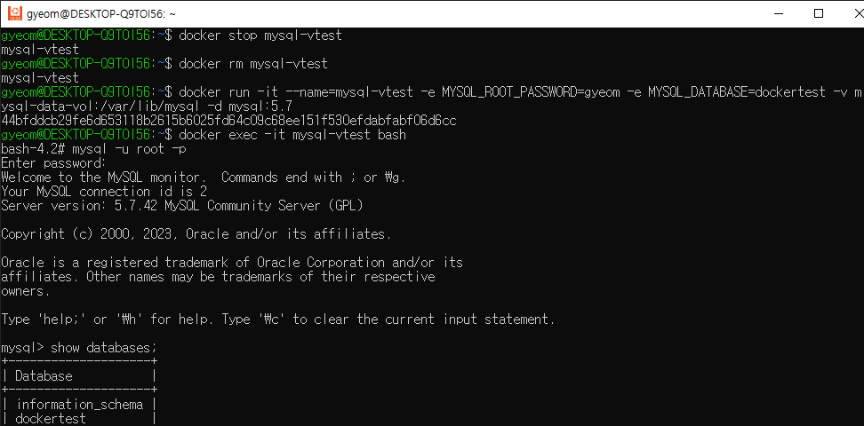

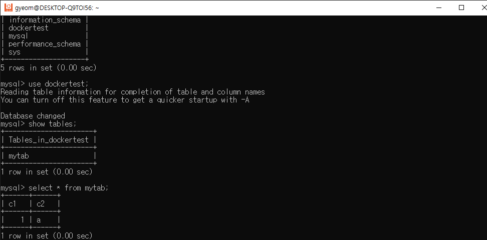

## 도커의 네트워크 활용

### 네트워크 확인

nginx:1.19 이미지의 컨테이너를 구동하고 상세 내역을 확인하면 아래와 같이 network 드라이버가 기본적으로 bridge 임을 확인할 수 있습니다.

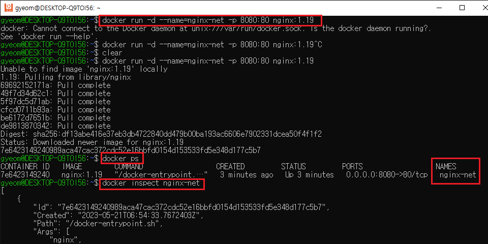

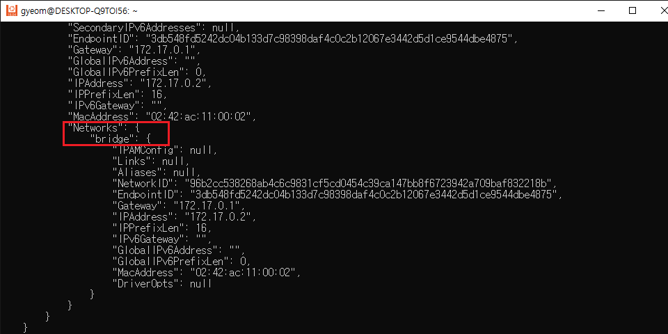

브리지 모드는 docker0 뿐만 아니라 사용자 정의 형태로도 사용 가능합니다. **docker network create** 명령을 통해 네트워크 대역이 다른 브리지 네트워크를 생성하여 실행해보겠습니다.

```docker
# webapp-vnet 이라는 custom network 생성
$ docker network create --driver=bridge webapp-vnet
# webapp-vnet으로 docker run
$ docker run -it -d --name=webapp --net=webapp-vnet ubuntu:20.04
```

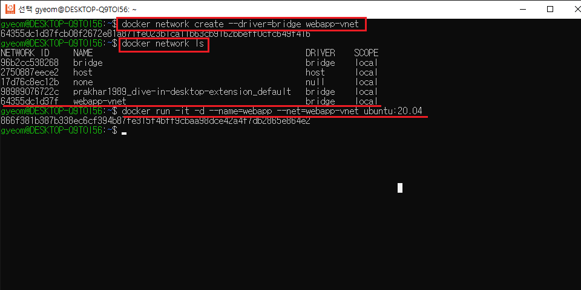

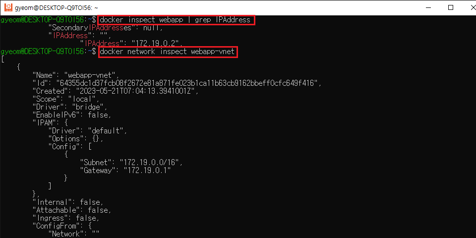

webapp-vnet을 inspect 한 결과 방금 실행한 ubuntu:20.04 컨테이너가 보이는 것을 확인할 수 있다.

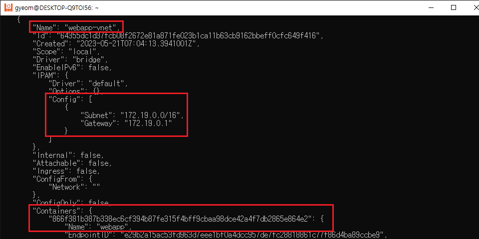

### 사용자 정의 네트워크 활용

브리지 네트워크 IP 대역은 순차적으로 할당됩니다. 하지만 특정 대역을 지정하여 도커 네트워크를 생성하고 그 대역에서 특정 IP를 지정할 수 있습니다.

```docker
$ docker network create \
> --driver bridge \
> --subnet 172.100.1.0/24 \
> --ip-range 172.100.1.0/24 \
> --gateway 172.100.1.1 \
> custom-net
```

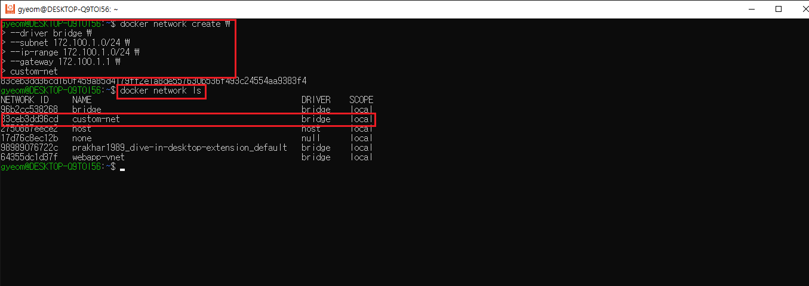

```docker
$ docker run -it -d \
> --net=custom-net \
> --name=custom-net1 \
> ubuntu:20.04

$ docker run -it -d \
> --net=custom-net \
> --name=custom-net2 \
> --ip 172.100.1.100 \
> ubuntu:20.04
```

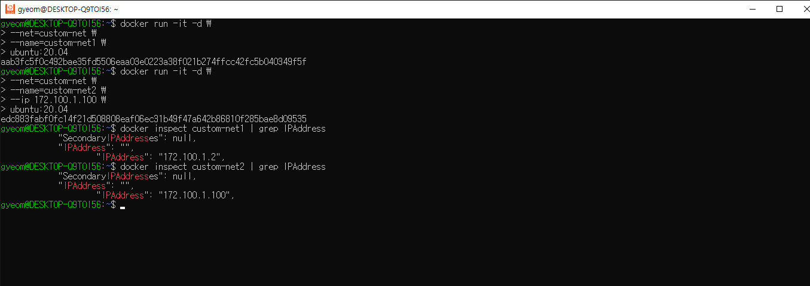

또한, 사용자 정의 브리지 네트워크와 docker run 수행 시 —net-alias 또는 —link 옵션으로 묶인 모든 컨테이너에는 기본적으로 서비스를 검색할 수 있는 내장 DNS 서버가 제공됩니다. 이 내장 DNS 서버는 특정 사용자 정의 네트워크에서 모든 컨테이너 별칭과 해당 IP 주소간의 매핑을 유지합니다.

```docker
$ docker run -itd --name nettest1 --net=netlb **--net-alias** inner-dns-net ubuntu:20.04
```

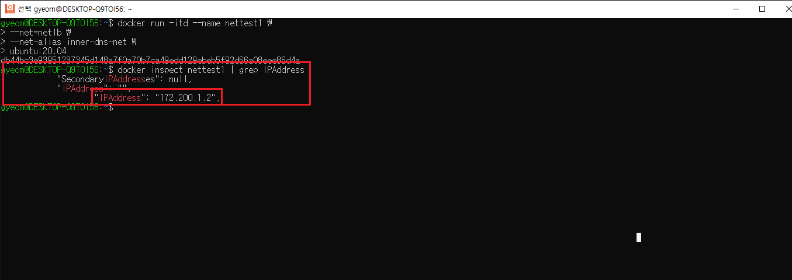

netlb라는 동일 사용자 정의 네트워크에 frontend 컨테이너를 실행합니다.

```docker
$ docker run -it --name=frontend --net=netlb ubuntu:14.04 bash
```

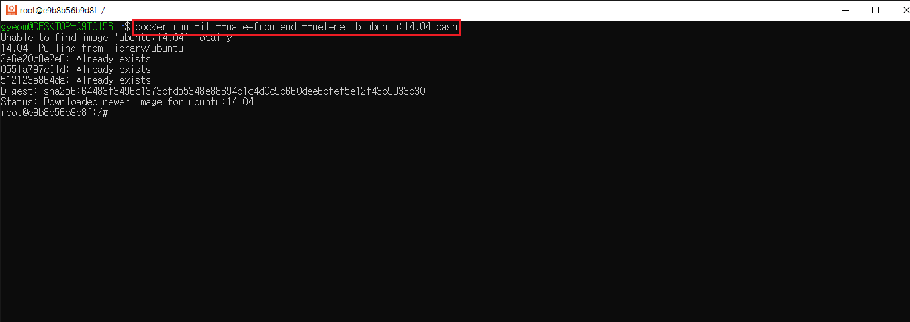

컨테이너 내부에서 별칭에 포함된 네트워크에 ping을 시도하면 —net-alias 옵션과 함께 실행했던 컨테이너가 ping을 받아주는 것을 확인할 수 있습니다.

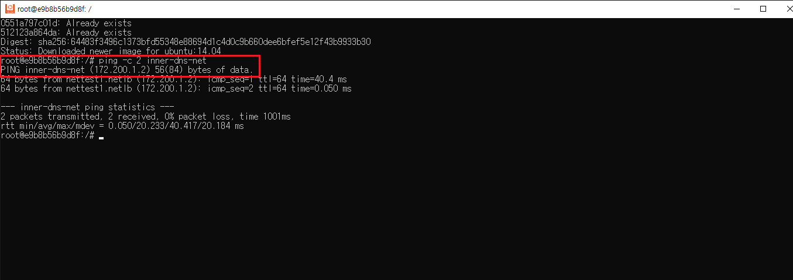

# References

[https://seosh817.tistory.com/345](https://seosh817.tistory.com/345)
[https://eunjinii.tistory.com/13](https://eunjinii.tistory.com/13)

[https://velog.io/@koo8624/Docker-유니온-파일-시스템-Union-File-System](https://velog.io/@koo8624/Docker-%EC%9C%A0%EB%8B%88%EC%98%A8-%ED%8C%8C%EC%9D%BC-%EC%8B%9C%EC%8A%A4%ED%85%9C-Union-File-System)

[https://gngsn.tistory.com/129](https://gngsn.tistory.com/129)

[https://velog.io/@ckstn0777/도커-볼륨](https://velog.io/@ckstn0777/%EB%8F%84%EC%BB%A4-%EB%B3%BC%EB%A5%A8)
