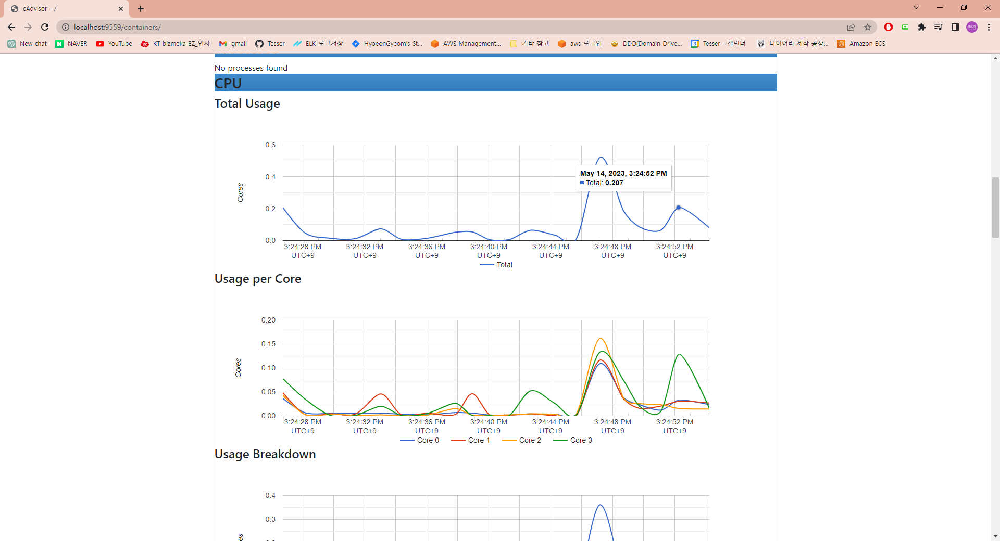
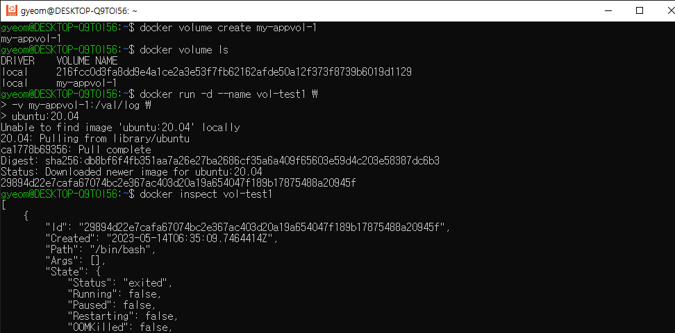
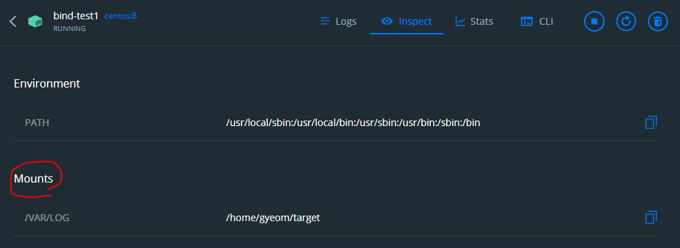

# 3장 컨테이너 서비스를 위한 도커 활용

# 주요 개념

### **가상머신 vs 도커**


가상머신은 호스트 OS 위에 Hypervisor라는 소프트웨어를 설치하고 이 Hypervisor를 통해 게스트 OS를 실행합니다. 게스트 OS는 가상 하드웨어에 대해 완전히 독립된 컨트롤을 가지기 때문에, 호스트 OS와 완전히 분리되어 동작합니다. 이러한 방식은 각 VM마다 필요한 운영체제와 라이브러리를 모두 가지고 있기 때문에 용량이 크고 배포 및 관리가 복잡합니다.

반면, 도커를 설치하면 호스트 OS 위에 도커 엔진이 설치되고 GuestOS 없이 호스트 OS 커널을 공유하여 호스트 OS 위에서 실행됩니다. 즉, 호스트 OS 위에 가상화된 환경을 만들어서 컨테이너를 실행합니다. 이때, 컨테이너 내부에서는 리눅스 커널을 사용하는데 도커엔진이 도커가 필요로 하는 리눅스 라이브러리와 커널 기능을 모두 포함하고 있습니다. 따라서, 호스트 OS의 종류나 버전과는 무관하게 도커 컨테이너는 내부적으로 리눅스 기반으로 동작합니다. 도커는 GuestOS가 따로 필요하지 않고 호스트 OS 위에 어플리케이션을 실행시킬 수 있으므로 훨씬 가볍고 간단합니다.

### **도커 이미지 레이어**

도커 이미지는 레이어(layer)로 구성되어 있습니다. docker pull 명령어를 치면 여러 layer가 각각 다운로드 되는 것을 확인할 수 있습니다.


도커는 레이어 방식을 사용하기 위해 **유니온 파일 시스템**(UnionFS)을 활용합니다.


유니온 파일 시스템(UFS)이란 여러 개의 파일 시스템을 하나의 파일 시스템에 마운트 하는 기능을 말합니다. 즉, 각 레이어는 이전 레이어(read only)를 기반으로하여 Writable 레이어을 스택처럼 쌓아서(합쳐서) 최종적인 파일 시스템을 구성하게 됩니다.


도커 이미지는 기존 레이어는 그대로 둔 채 새로 업데이트된 내용만 담고 있는 레이어만 쌓는 UFS의 CoW(Copy on Write) 전략을 사용합니다. 도커에서는 레이어가 크게 컨테이너 레이어(상위)와 이미지 레이어(하위)로 구분됩니다. **기존의 읽기 전용 이미지 레이어(하위) 위에 읽기/쓰기 전용 레이어(상위)를 추가합니다.** 이미지 레이어를 그대로 불변의 레이어로 사용하면서, 컨테이너가 애플리케이션 실행 중에 생성하는 모든 파일이나 변경사항은 R/W layer에 저장되므로 여러 개의 컨테이너를 실행하면서 이미지는 불변성을 유지할 수 있습니다.

이렇게 레이어 방식으로 도커 이미지를 관리하면 다음과 같은 장점을 얻을 수 있습니다.

1. 효율적인 이미지 관리: 도커 레이어를 사용하면 각 이미지 레이어를 개별적으로 관리할 수 있습니다. 이전에 빌드한 이미지의 레이어를 재사용하여 새로운 이미지를 더 빠르게 구축할 수 있습니다.
2. 빠른 배포: 필요한 이미지 레이어만 다운로드하여 이미지를 더 빠르게 배포할 수 있습니다.
3. 용량 절감: 도커 이미지는 레이어를 사용하여 중복된 파일을 제거하고 필요한 레이어만 저장하므로 디스크 공간을 절약할 수 있습니다.
4. 보안: 각 레이어는 변경할 수 없으며, 이미지를 수정하면 새로운 레이어가 생성되므로 이전 버전을 되돌릴 수 있습니다. 또한, 이미지를 다운로드할 때 각 레이어의 체크섬을 확인하여 이미지의 무결성을 보장할 수 있습니다.

### 도커 \***\*namespace와 cgroup\*\***

- namespace


Docker를 사용할 때 어떻게 Process나 Network 등이 \*\*\*\*어떻게 각 컨테이너마다 따로 관리될까요?

도커에서는 각 컨테이너가 호스트와 완전히 격리된 환경에서 실행될 수 있도록 네임스페이스와 컨트롤 그룹(cgroup)을 사용합니다.

VM에서는 각 게스트 머신별로 독립적인 공간을 제공하고 서로가 충돌하지 않도록 하는 기능을 갖고 있습니다. 반면, Docker에서는 **namespaces**를 통해 이러한 **독립된 공간을 제공**합니다.

namespace는 nested process tree를 만들 수 있게 해주며, 각 프로세스가 시스템 리로스와 함께 분리된 프로세스 트리를 가질 수 있습니다.

- pid name spaces : 프로세스 격리 처리 (독립된 프로세스 공간 할당)
- net name spaces : 네트워크 인터페이스
- ipc name spaces : IPC 자원에 대한 엑세스 관리
- mnt name spaces : 파일 시스템 포인트 관리
- uts name spaces : host name 할당


모든 시스템은 부팅 시 PID 1 프로세스가 시작되고 그 아래에 모든 프로세스들이 시작됩니다.

이때, **PID namespace로 격리**를 하게 되면 하위 namespace의 프로세스가 상위 프로세스의 존재를 알 수 없게 됩니다. 반대로 상위 namespace의 프로세스는 다른 프로세스인 것처럼 하위 namespace의 프로세스를 전체적으로 볼 수 있습니다. 그림에서 보이듯이, PID namespace 격리를 통해 새로 생성된 하위 프로세스는 하나의 시스템인 것처럼 pid를 1로 가정하여 사용됩니다.

- cgroup

컨트롤 그룹(cgroup)은 이렇게 분리된 프로세스 환경의 리소스 사용을 제한하고 관리하는 기능을 제공합니다. 예를 들어, 컨테이너마다 CPU 할당량을 제한하므로, 호스트에서 다른 컨테이너가 CPU를 독점하지 못합니다. 기본적으로 프로세스 그룹별로 시스템의 물리적인 리소스(hardware resources)를 제한이나 제약 조건을 적용할 수 있습니다. 제한할 수 있는 리소스에는 아래와 같은 것들이 있습니다.

- CPU
- Memory
- Desk I/O
- Network
- Device

이러한 네임스페이스와 cgroup을 사용하여 도커는 컨테이너 간의 충돌을 방지하고, 호스트 시스템의 안정성을 유지하며, 컨테이너에서 필요한 리소스를 제한할 수 있습니다.

### 도커 네트워크


Docker는 가상화된 환경에서 컨테이너를 실행시키는데, 컨테이너는 각각 독립적인 네트워크 환경을 가지고 있습니다. Docker에서는 이를 위해 독자적인 네트워크 모델을 제공하여 컨테이너의 네트워크를 관리하고 있습니다. Docker는 기본적으로 네트워크를 구성할 때 가상의 브리지 네트워크(docker0)를 생성하고, 컨테이너들은 이 네트워크를 사용하여 서로 통신합니다.

**`docker0`**는 Linux 시스템에서 브리지를 구현하기 위해 사용되는 가상 인터페이스입니다.이 가상 네트워크 인터페이스는 도커 호스트에 있는 **`docker0`** 브리지 네트워크와 컨테이너마다 생성되는 **`veth`** 인터페이스, 그리고 컨테이너 내부에서 동작하는 애플리케이션이 사용하는 **`eth`** 인터페이스로 구성됩니다. 모든 컨테이너는**`docker0`**인터페이스를 통해 서로 통신하게 됩니다. 일반적으로 **`docker0`**는 브리지 역할을 수행하며, 호스트 시스템과 컨테이너들 간의 패킷을 라우팅합니다. 또한, Docker에서 컨테이너에 할당되는 IP 주소는 **`docker0`**에 의해 관리됩니다. Docker는 브리지(bridge) 네트워크 이외에도 host, none, overlay 등의 네트워크 드라이버를 제공합니다. 이 네트워크 드라이버는 컨테이너가 호스트 머신에서 어떻게 통신할지에 대한 규칙을 제공합니다.

**네트워크 드라이버**

- bridge: 기본 네트워크 드라이버로 독립적으로 실행되는 애플리케이션 컨테이너를 실행하는 경우 사용된다.
- host: 컨테이너와 호스트 간의 네트워크 격리를 제거하고 호스트의 네트워킹을 직접 사용할 수 있다. 포트 포워딩 필요 없이 호스트의 포트로 바로 접속 가능
- overlay: 다중 호스트에 컨테이너가 구성되어 있는 경우 도커 데몬간의 연결을 통해 컨테이너 서비스 수행 가능. 도커 클러스터인 도커 스웜 구축 시 호스트와 호스트 간의 컨테이너 연결에 사용됨
  즉, 다른 호스트에 있는 컨테이너 간의 연결에 사용됨
- macvlan: mac 주소를 통한 직접 연결 구현시 사용됨
- none: 컨테이너의 네트워크를 사용하지 않도록 설정. 인터페이서 lo 인터페이스만 존재하여 루프백만 접근, 외부 통신 단절

# 실습

## 컨테이너 실행 및 접속

### **mysql:5.7**

```bash
$ docker pull mysql:5.7

$ docker run -d -p 3308:3306 -e MYSQL_ROOT_PASSWORD=root --name mysql_container mysql:5.7
```


### **cAdviosr**

```bash
sudo docker run \
  --volume=/:/rootfs:ro \
  --volume=/var/run:/var/run:ro \
  --volume=/sys:/sys:ro \
  --volume=/var/lib/docker/:/var/lib/docker:ro \
  --volume=/dev/disk/:/dev/disk:ro \
  --publish=9559:8080 \
  --detach=true \
  --name=cadvisor \
  zcube/cadvisor:latest
```


## 도커 볼륨 활용

### 볼륨

```bash
# 볼륨 생성
$ docker volume create my-appvol-1

# 볼륨 리스트 확인
$ docker volume ls

# -v 옵셔을 이용한 볼륨 지정
$ docker run -d --name vol-test1 \
> -v my-appvol-1:/var/log \
> ubuntu:20.04 #

```




### 바인드마운트

```bash
# directory 생성
$ mkdir /home/gyeom/target

# 바인드 마운트 지정 centos:8 실행
$ docker run -d -it --name bind-test1 \
--mount type=bind.source="$(pwd)"/target,target=/var/log \
centos:8
```




### 볼륨 지정 데이터 지속성 확인

```bash
# mysql 컨테이너 접속
$ docker exec -it mysql-vtest bash

# mysql 접속 및 데이터 생성
$ mysql -u root -p
$ use dockertest;
$ create table mytab(c1 int, c2 char);
$ insert into mytab values(1,'a');
$ select * from mytab;

# docker container 중지 및 재 가동 후 데이터 확인
$ docker run -d -it --name bind-test1 \
--mount type=bind.source="$(pwd)"/target,target=/var/log \
centos:8
# 이후 위 내용 반복

```





# 네트워크치

```bash
# docker portainer 명령어

$ docker create volume portainer_data

$ docker run -d -p 8000:8000 -p 9000:9000 --restart=always --name portainer -v /var/run/docker.sock:/var/run/docker.sock -v /home/volumes/portainer_data:/data portainer/portainer
```

# References

[https://seosh817.tistory.com/345](https://seosh817.tistory.com/345)
[https://eunjinii.tistory.com/13](https://eunjinii.tistory.com/13)

[https://velog.io/@koo8624/Docker-유니온-파일-시스템-Union-File-System](https://velog.io/@koo8624/Docker-%EC%9C%A0%EB%8B%88%EC%98%A8-%ED%8C%8C%EC%9D%BC-%EC%8B%9C%EC%8A%A4%ED%85%9C-Union-File-System)

[https://gngsn.tistory.com/129](https://gngsn.tistory.com/129)
