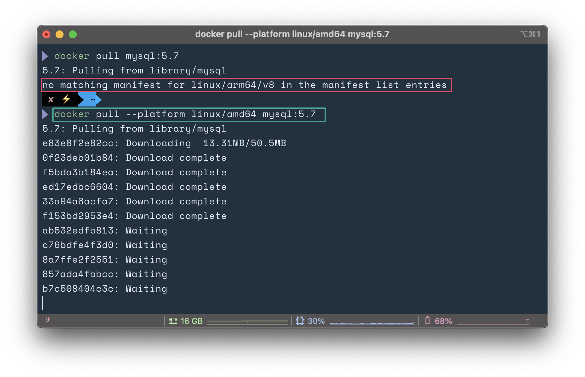
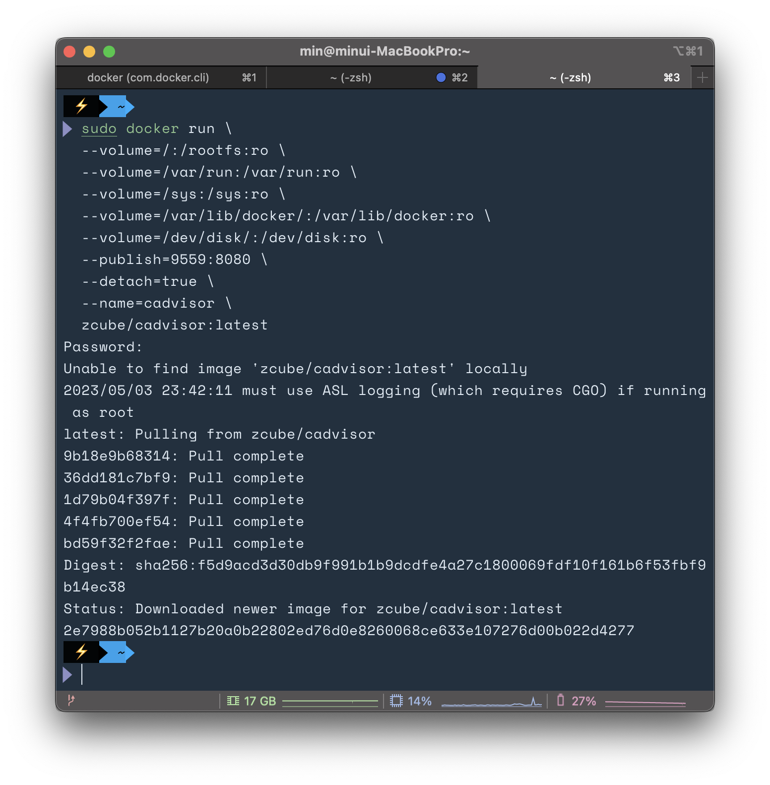
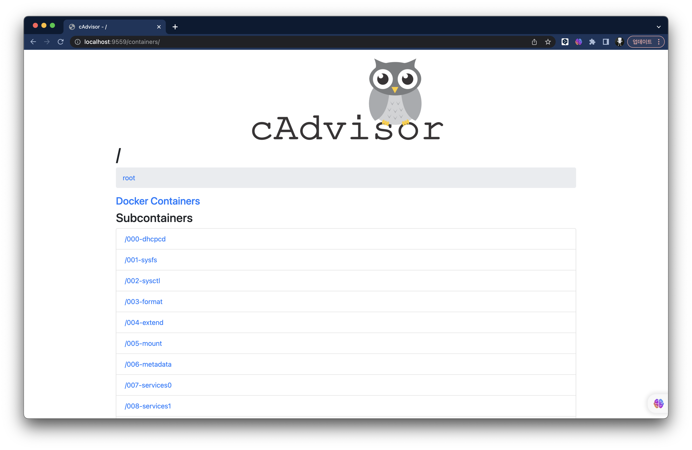
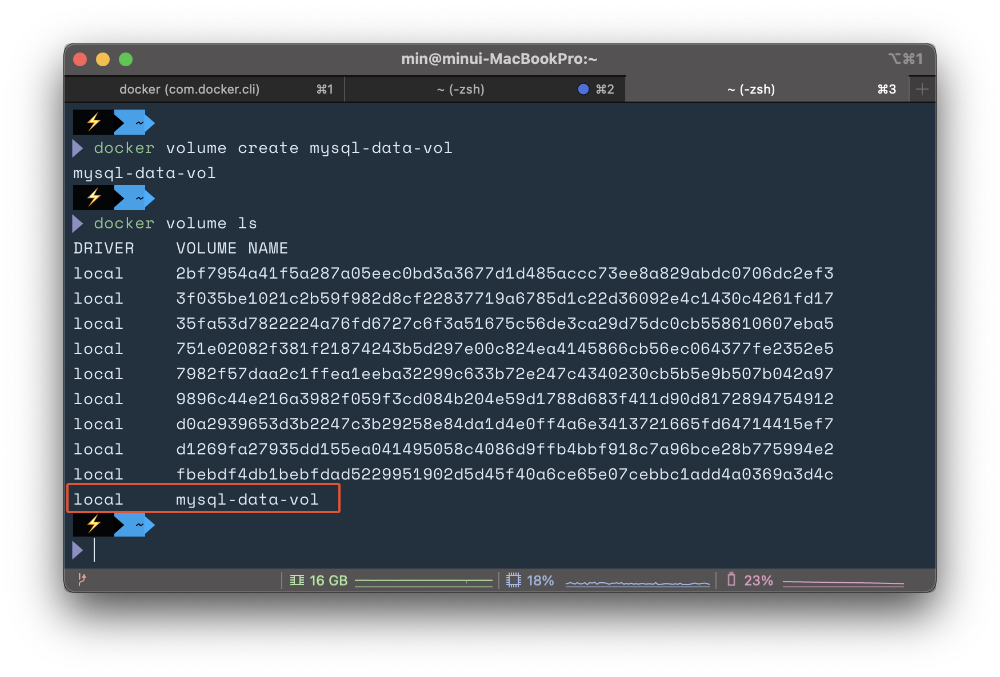
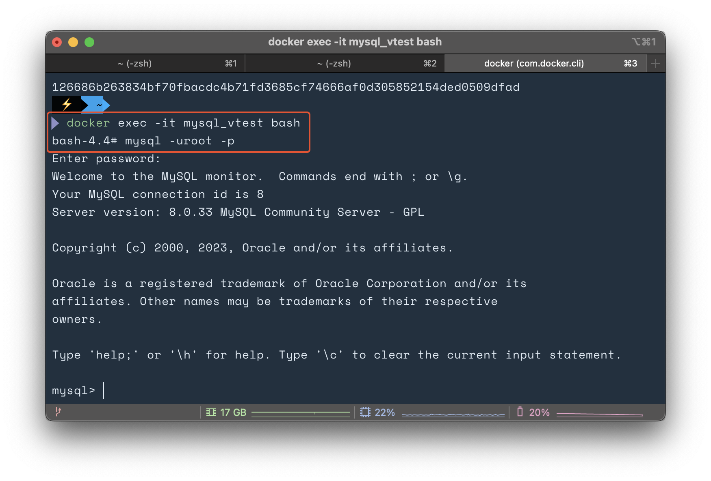
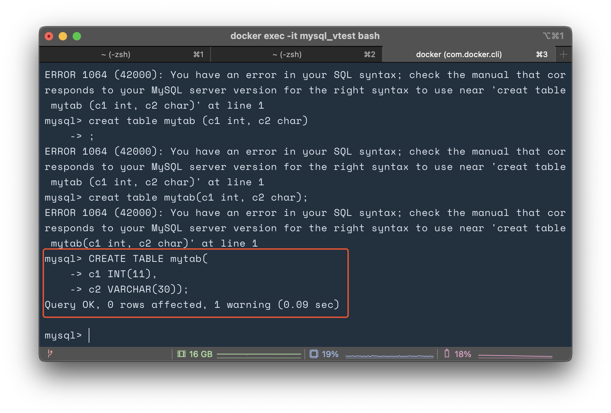
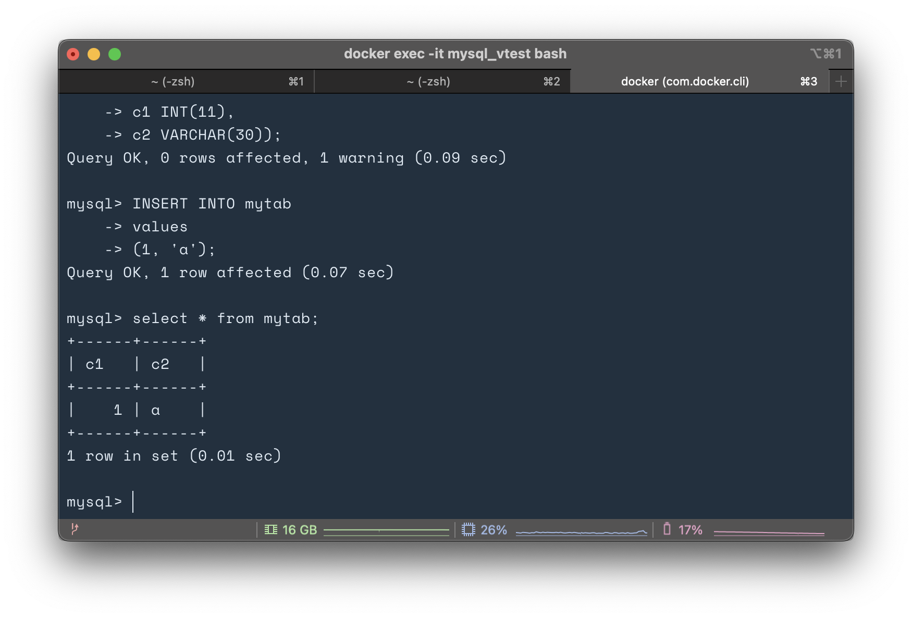
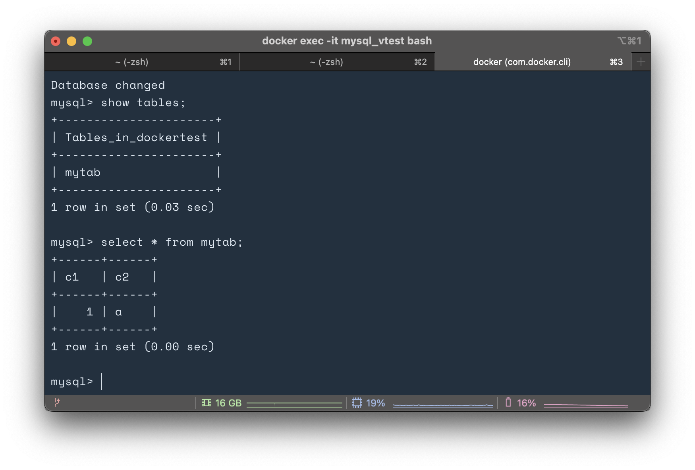

## 실습 3-1. SQL 테스트를 위한 MySQL 5.7

```bash
# mysql 5.7 다운로드
docker pull mysql:5.7
```



- M1 MacOS의 경우 에러가 발생하므로 --platform을 지정해야됨


- docker pull을 할 때도 똑같이 플랫폼 지정 필요
- 결국 mysql:5.7 version은 실패하고, mysql:8.0.33 버전으로 진행
  - /etc/init.d/mysql 파일이 존재하지 않음

### 수정된 명령어!

```bash
# amd64 latest version pull
 docker pull --platform linux/amd64 mysql

# mysql run, port와 password 지정
docker run --platform linux/amd64 -d -p 3306:3306 -e MYSQL_ROOT_PASSWORD=root --name mysql_container mysql

# container 실행, run으로 바로 실행시 오류
 docker exec -it mysql bash
```


## 실습 3-2. cAdvisor 컨테이너 실행

```bash
sudo docker run \
  --volume=/:/rootfs:ro \
  --volume=/var/run:/var/run:ro \
  --volume=/sys:/sys:ro \
  --volume=/var/lib/docker/:/var/lib/docker:ro \
  --volume=/dev/disk/:/dev/disk:ro \
  --publish=9559:8080 \
  --detach=true \
  --name=cadvisor \
  zcube/cadvisor:latest
```



- M1의 경우 실습에 나온 google/cadvisor로 돌리면 오류가 발생 -> zcube/cadvisor로 변경
- 도커가 설치된 호스트의 IP는 기본 localhost를 사용하니까 제대로 구동 되는 것을 확인




- CPU 실시간 동작도 확인 가능 (유용하게 사용 가능할듯)


## 3-6 데이터베이스의 데이터 지속성 유지



- my-data-vol 이라는 volume이 생성됨
- 위의 volume들은 container 생성 시 자동으로 생긴 NAME
  - name을 지정하면 volume 확인 시 가독성이 좋음

```
docker run -d --name mysql_vtest \
-e MYSQL_ROOT_PASSWORD=root \
-e MYSQL_DATABASE=dockertest \
--platform linux/amd64  \
-p 3306:3306 \
-v mysql-data-vol:/var/lib/mysql \
mysql

 docker exec -it mysql_vtest bash
```




- /etc/init.d/mysql start를 하지 않아도 자동으로 실행이됨.



- mysql:8.0 version과 mysql:5.7은 문법도 다른 것 같음
- 아래와 같이 table 생성 코드 수정

```mysql
# mysql:5.7 
creat table mytab(c1 int, c2 char);
# >> ERROR 1064 (42000): You have an error in your SQL syntax;

# mysql:8.0
CREATE TABLE mytab(
    -> c1 INT(11),
    -> c2 VARCHAR(30));
# >> Query OK, 0 rows affected, 1 warning (0.09 sec)

# mysql:8.0 insert
INSERT INTO mytab
    -> values
    -> (1, 'a');
# >> Query OK, 1 row affected (0.07 sec)
```

- 아무래도 char가 -> varchar로 변경되었고, 크기도 추가해야 되는 것 같음



- 컨테이너 서비스 종료 후 다시 접속해도 그대로 데이터가 유지되는 것을 확인!!


