## Nginx 컨테이너를 실행한 브리지 모드

- 호스트 모드로 연결하게 되면 보안상 문제가 생길 우려가 있다. 
- 이에 실제 서버 네트워크와 분리해 독립적으로 구성하는 네트워크를 실습한다. 

```
# nginx port 연결
$ docker run -d --name=nginx-net -p 8080:80 nginx:1.19

# 열려있는 포트 확인
$ sudo netstat -nlp | grep 8080
tcp        0      0 0.0.0.0:8080            0.0.0.0:*               LISTEN      75809/docker-proxy  
tcp6       0      0 :::8080                 :::*                    LISTEN      75815/docker-proxy  
```

<center>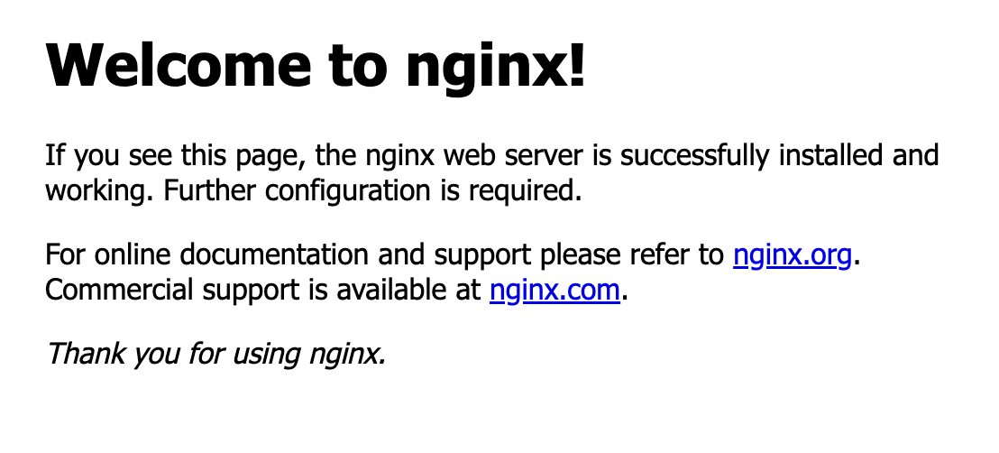</center>


## 네트워크 카드 추가 실습: docker connect (133p)

```bash
# 네트워크 1: app-net 기본 network 생성
docker network create -d bridge app-net

# 연결 정보 확인
ifconfig
```

<center>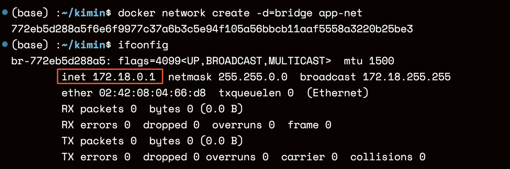</center>

- docker0가 아닌 772eb5d288a5의 ID를 가지는 네트워크 대역이 다른(127.18.0.0/16) 독립된 브리지 네트워크 `app-net` 생성

```bash
# 컨테이너: 기본 네트워크를 사용하는 컨테이너 생성
docker run -it --name ubuntu-container --net app-net ubuntu:14.04 bash

root@a920672c22eb:/# ifconfig
```

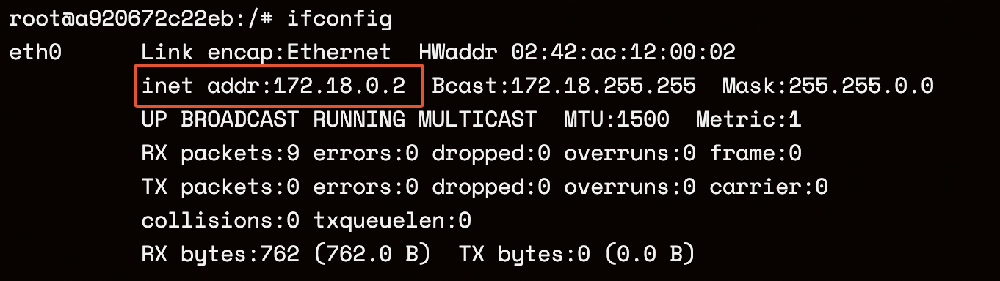

- ubuntu-container 컨테이너가 app-net 네트워크 대역에 순차적으로 할당되었음을 확인

```bash
# 네트워크 2: 관리용 네트워크 생성하여 실행중인 ubuntu-container에 연결
docker network create -d bridge admin-net

docker network ls

ifconfig
```

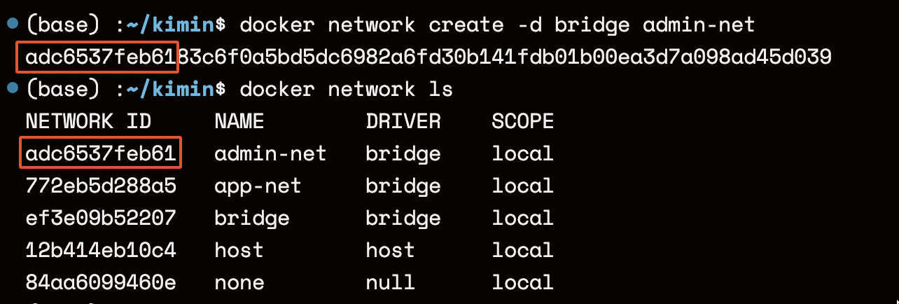

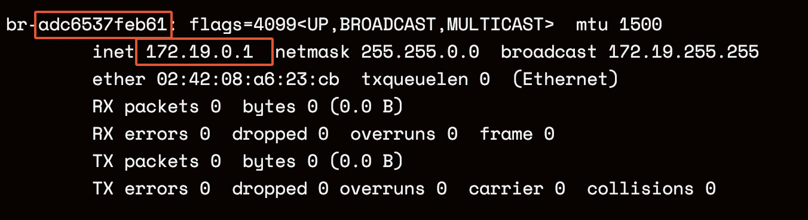

- adc6537feb61의 네트워크 ID를 가지는 네트워크 대역이 다른(127.19.0.0/16) 독립된 네트워크 브리지 `admin-net` 생성


```bash
# ubuntu-container 컨테이너에 admin-net 추가 연결
docker network connect admin-net ubuntu-container 

# 컨테이너:  연결된 네트워크 정보를 확인
docker exec ubuntu-container route 

ifconfig
```


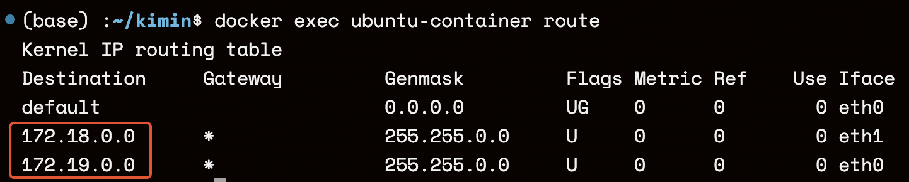

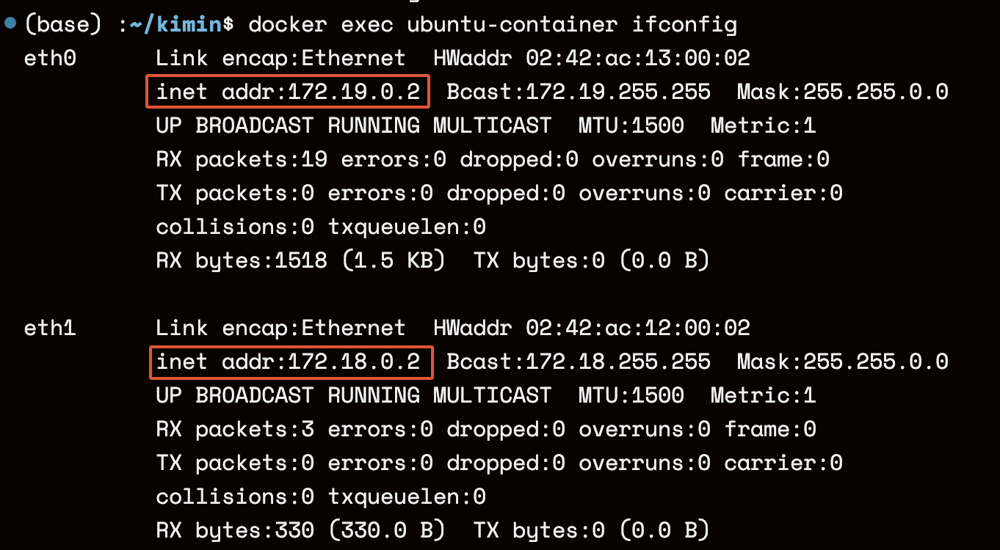

- 2개의 네트워크가 정상적으로 연결되었음을 확인


```bash
# 네트워크 2: 두 번째 생성한 네트워크 정보 조회를 통해 연결된 컨테이너 확인
docker network inspect admin-net
```

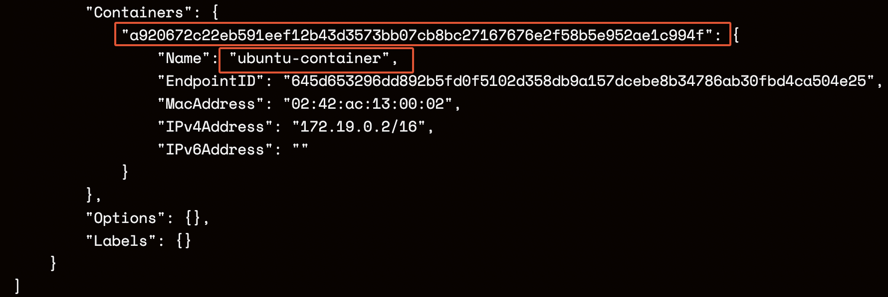

- ubuntu-container가 정상적으로 연결되어 있음


## nginx를 이용한 컨테이너 로드 밸런스 구축 (140p)


```bash
# nginx 설치 후 서비스 확인
sudo apt update 
sudo apt-get -y install nginx
sudo systemctl status nginx.service
sudo netstat -nlp | grep 80
```

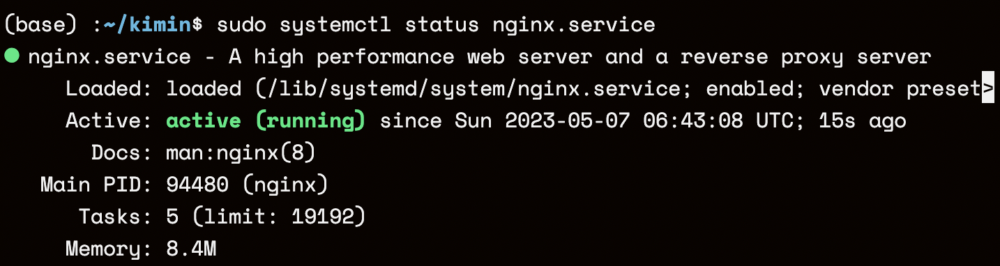

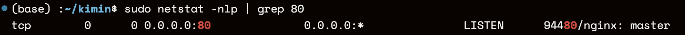

- nginx 서비스 실행 후 포트 개방 확인

```bash
# phpserver repo clone
git clone https://github.com/brayanlee/docker-phpserver.git
cd docker-phpserver
```

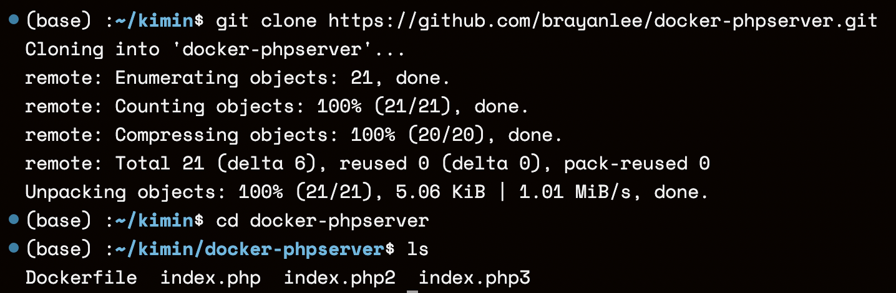


```bash
# phpserver:1.0 이미지 빌드
docker build -t phpserver:1.0 .
docker images
```

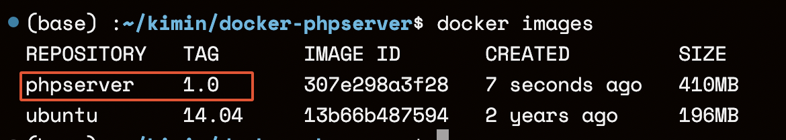

```bash
# nginx 프락시를 통해 연결될 웹 어플리케이션 컨테이너 3개 실행
docker run -itd -p 5001:80 \
-h nginx-lb01 \
-v ${pwd}/lb01:/var/log/apache2 \
-e SERVER_PORT=5001 \
--name nginx-lb01 \
phpserver:1.0

docker run -itd -p 5002:80 \
-h nginx-lb02 \
-v ${pwd}/lb02:/var/log/apache2 \
-e SERVER_PORT=5002 \
--name nginx-lb02 \
phpserver:1.0

docker run -itd -p 5003:80 \
-h nginx-lb03 \
-v ${pwd}/lb03:/var/log/apache2 \
-e SERVER_PORT=5003 \
--name nginx-lb03 \
phpserver:1.0
```

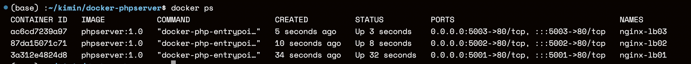

- 컨테이너 3개 모두 실행 완료

```bash
# sample index.php3를 컨테이너에 복사
docker cp index.php3 nginx-lb01:/var/www/html/index.php
docker cp index.php3 nginx-lb02:/var/www/html/index.php
docker cp index.php3 nginx-lb03:/var/www/html/index.php
```


```bash
# 컨테이너와 연결된 포트 확인
sudo netstat -nlp | grep 5001
sudo netstat -nlp | grep 5002
sudo netstat -nlp | grep 5003
```

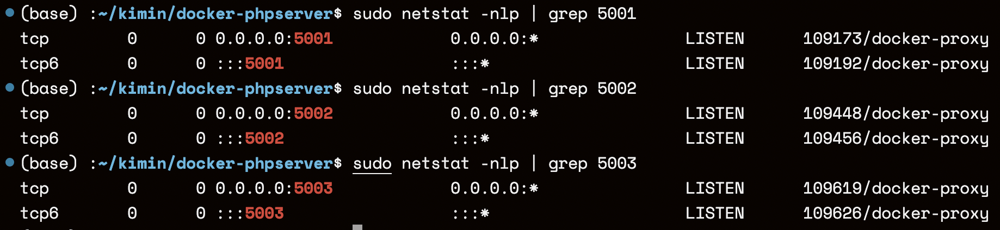

- 정상적으로 연결되어 있음을 확인

```bash
# nginx 프락시를 구성. 각 포트별로 라운드 로빈 방식으로 컨테이너에 패킷 전달
sudo vi /etc/nginx/nginx.conf

"""
events {
        worker_connections 1024;
        # multi_accept on;
}

http {
        # 애플리케이션 컨테이너 주소 정보
        upstream backend-lb {
           server 127.0.0.1:5001;
           server 127.0.0.1:5002;
           server 127.0.0.1:5003;
        }

        # 웹 서버 구성에 대한 정보
        server {
            listen 8000 default_server;
            listen [::]:8000 default_server;
            # 연결 프락시 정보
            location / {
                proxy_pass http://backend-lb;
            }
         }
      }
"""
```

- default server 정보를 80이 아닌 8000으로 설정해야 정상적으로 실행됨
  - 이미 80 포트에 다른 nginx가 실행되고 있음
  - nginx[113775]: nginx: [emerg] a duplicate default server for 0.0.0.0:80 in /etc/nginx>

```bash
# nginx 서비스 재시작 후 상태 조회
sudo systemctl restart nginx.service
sudo systemctl status nginx.service
```

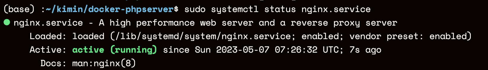

```bash
# 로드 밸런스 기능이 제대로 동작하는지 확인
cd /etc/nginx/

curl localhost:8000
```

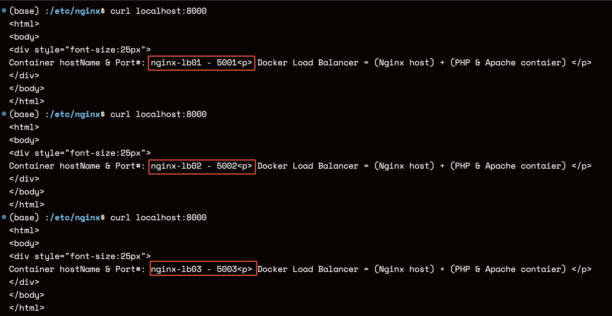

- 호스트명과 포트번호가 순차적으로 변경되는 것을 확인할 수 있음

