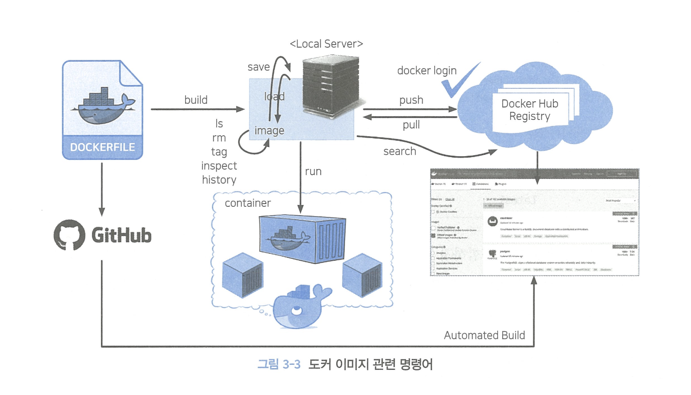

# 3장: 컨테이너 서비스를 위한 도커 활용

## 3.1 컨테이너 서비스

### 3.1.1 컨테이너 서비스란?

- 논리적 패키징 매커니즘: 컨테이너 서비스는 애플리케이션 실행에 필요한 바이너리, 라이브러리, 구성 파일 등을 패키지로 묶어 배포
- 의존성 문제 해결: 하드웨어, 운영체제, 라이브러리 등의 의존성 문제를 해결
- 운영체제 레벨 가상화: 호스트 운영체제를 공유하면서 격리된 공간에서 프로세스를 동작

### 3.1.2 왜 도커 컨테이너 서비스일까?

- 도커 기반 애플리케이션 개발 라이프사이클
  
- IaC(Infrastructure as Code): 컨테이너 동작에 필요한 모든 내용을 코드로 관리하여 필요할 때마다 애플리케이션 및 서버 환경을 적은 비용으로 빠르게 개발, 배포, 확장 가능

## 3.2 도커 명령어 활용

### 3.2.1 도커 이미지 명령어

도커 허브 관련 이미지 명령어

- docker pull: 도커 허브 레지스트리에서 이미지를 가져옴
- docker push: 도커 허브 레지스트리에 이미지를 업로드
- docker login: 업로드 전 도커 허브 레지스트리에 로그인
- docker logout: 도커 허브 레지스트리에서 로그아웃

다이제스트(digest)란?

- 도커 이미지의 고유한 ID
- 도커 이미지의 내용이 변경되면 다이제스트도 변경됨

도커 이미지 정보 조회(docker image ls)

도커 이미지 세부 정보 조회(docker image inspect)

- image ID: "id"
- 생성일: "created"
- Docker 버전: "DockerVersion"
- CPU 아키텍처: "Architecture"
- 이미지 다이제스트 정보: "RootFS"
- 이미지 레이어 저장 정보: "GraphDriver"
  

도커 이미지 레이어에 관한 설명

- 도커 이미지 레이어: 도커 이미지는 여러 개의 읽기 전용 레이어로 구성
- 유니언 파일 시스템(UnionFS): 여러 개의 레이어를 하나의 파일 시스템으로 사용할 수 있도록 함
  
  이미지가 변경되어도 변경된 부분만 따로 다운받아 사용하기 때문에 효율적

**도커 데이터 및 로그 정보 저장 경로: /var/lib/docker**

도커 이미지 태그 설정

- 도커 이미지 태그 설정: docker image tag [이미지명]:[태그명] [이미지명]:[태그명]

도커 허브 업로드

- 도커 허브 업로드: docker push [이미지명]:[태그명]
  
  

- 도커 이미지 파일로 관리
  - docker image save: 도커 이미지를 파일로 저장
  - docker image load: 도커 이미지 파일을 불러옴

### 3.2.2 도커 컨테이너 명령어

**컨테이너 = 프로세스**

- 도커 컨테이너는 도커 이미지 기반 스냅샷
- 읽기 전용 도커 이미지 레이어 복제본 위에 읽기/쓰기 레이어를 추가하여 컨테이너 생성
- OCI(Open Container Initiative)로 컨테이너 포맷과 런타임에 대한 표준화 목적으로 리눅스 파운데이션의 지원을 받아 구성된 오픈 프로젝트

docker run 명령어

- docker run [옵션] [이미지명]:[태그명] [실행할 파일]
  - 옵션
    - -i, --interactive: 대화식 모드 열기
    - -t, --tty: 가상 터미널 활성화
    - -d, --detach=true: 컨테이너를 백그라운드에서 실행 후 컨테이너 ID 등록
    - --name: 컨테이너 이름 설정(지정하지 않으면 랜덤으로 생성)
    - rm: 컨테이너 종료 시 컨테이너 자동 삭제
    - restart: 컨테이너 재시작 정책 설정
    - env: 컨테이너 내부 환경 변수 설정
    - -v, --volume: 호스트와 컨테이너 간 디렉터리 공유(Bind Mount)
    - -h: 컨테이너 호스트 이름 설정(지정하지 않으면 미지정시 컨테이너 ID로 설정)
    - -p, --publish: 호스트와 컨테이너 간 포트 공유(Port Mapping)
    - --link=[container:container_id]: 동일 호스트의 다른 컨테이너와 연결 설정으로 IP가 아닌 컨테이너의 이름을 이용해 통샌
    - -P, --publish-all=[true|false]: 컨테이너 내부의 노출된 포트를 호스트 임의 포트에 게시

docker rename 명령어

- docker rename [변경 전 이름] [변경할 이름]

docker diff 명령어

- docker diff [컨테이너 ID]: 컨테이너 내부에서 변경된 파일 목록 조회
  
- docker diff [컨테이너 ID] | grep [파일명]: 컨테이너 내부에서 변경된 파일 목록 중 특정 파일만 조회

### 3.2.3 도커 볼륨 활용

- 도커 볼륨: 여러 컨테이너 간에 안전하게 볼륨을 공유

  - docker volume create [볼륨명]: 볼륨 생성
  - docker volume ls: 볼륨 목록 조회
  - docker volume inspect [볼륨명]: 볼륨 세부 정보 조회
  - docker volume rm [볼륨명]: 볼륨 삭제

- bind mount

  - 도커 볼륨 기법에 비해 사용이 제한적
  - 호스트 파일 시스템 절대 경로: 컨테이너 내부 경로를 직접 마운트하여 사용
  - 사용자가 파일 또는 디렉터리 생성 -> 호스트 파일 시스템의 소유자 권한으로 연결, 존재하지 않는 경우 자동 생성(루트 사용자 소유)
  - 컨테이너 실행 시 지정하여 사용, 제거 시 바인드 마운트는 해제되지만 호스트 디렉터리는 유지

- tmpfs mount
  - 임시적으로 호스트 메모리에서만 지속, 컨테이너 중지 시 마운트 제거 -> 내부 파일 삭제
  - 중요한 파일을 임시로 사용하는 방법에 유용

### 3.2.4 도커 컨테이너 자원 사용에 대한 런타임 제약

서버 자원 모니터링

자주 사용하는 모니터링 도구

- top: CPU, 메모리, 스왑, 프로세스 정보 조회
- htop: top 명령어의 확장 버전
- sar: CPU, 메모리, 디스크, 네트워크, 프로세스 정보 조회
- iostat: 디스크 성능 지표인 IOPS, MBPS 측정 가능(sar과 함께 설치)
- vmstat, free: 메모리 성능 측정
- dstat: 서버 전반 자원 사용량 모닡처링, 개별 옵션으로 제어 가능
- iptraf-ng: 서버로 유입되는 네트워크 인터페이스별 패킷양, 프로토콜 등을 통한 네트워크 트래픽 모니터링

도커 컨테이너 자원 제약

- CPU: --cpu-shares, --cpu-quota, --cpu-period
- 메모리: --memory, --memory-swap
- 블록 I/O: --blkio-weight, --device-read-bps, --device-write-bps, --device-read-iops, --device-write-iops

### 3.2.5 도커 네트워크

개요

- 도커 컨테이너 및 서비스는 도커 네트워크를 통해 컨테이너 간 연결 뿐 아니라 다른 애플리케이션 워크로드와도 연결 가능
- 도커 네트워크 드라이버 사용
- 도커 설치 시 기본 제공되는 DockerOsms 소프트웨어적으로 구현된 가상 이더넷 브릿지 네트워크, 이것을 통해 격리된 컨테이너 간 통신 제공
- 별도 브릿지 구성하지 않는 한, 모든 컨테이너는 dockerO 브릿지에 연결
  (172.17.0.0/16의 CIDR 범위로 IP 할당)

- 도커 네트워크 목록 조회
  - docker network ls
    

도커 기본 브리지 네트워크 활용

- 브릿지 모드 네트워크 구성: 도커 데몬을 통해 도커 컨테이너만의 네트워크를 실제 서버 네트워크와 분리해 독립적으로 구성하는 네트워크 방식
  

### 3.2.6 도커 kill 명령과 초기화
