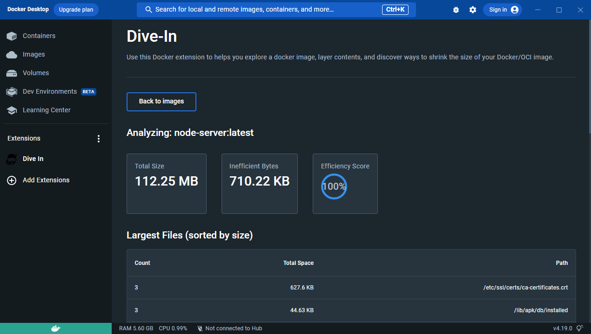

# 4장 컨테이너 환경 구성을 위한 Dockerfile 구성

# Dockerfile 활용

## 셸 스크립트 이용 Dockerfile 환경 구성

1. Dockerfile 생성
2. RUN 구문에 셸 스크립트 파일 생성 및 작성
3. Dockerfile 기반 docker container 실행

```docker
## base image ubuntu:18.04
FROM ubuntu:18.04

# 아피치2에 필요한 환경 변수, 디렉터리, 서비스 실행 등의 셸 스크립트
RUN apt-get update && apt-get -y install apache2
RUN echo 'Docker Container Application.' > /var/www/html/index.html
RUN mkdir /webapp
RUN echo '. /etc/apache2/envvars' > /webapp/run_http.sh && \
    echo 'mkdir -p /var/run/apache2' >> /webapp/run_http.sh && \
    echo 'mkdir -p /var/lock/apache2' >> /webapp/run_http.sh && \
    echo '/usr/sbin/apache2 -D FOREGROUND' >> /webapp/run_http.sh && \
    chmod 744 /webapp/run_http.sh

# 80번 포트 오픈
EXPOSE 80
# 컨테이너 동작 시 실행될 RUN 명령어로 작성된 셸 스크립트
CMD /webapp/run_http.sh
```


**RUN, CMD, ENTRYPOINT** 차이

- RUN

RUN 명령문는 쉘(shell)에서 커맨드를 실행하는 것처럼 이미지 빌드 과정에서 필요한 커맨드를 실행하기 위해 사용된다.

보통 이미지 안에 특정 소프트웨어를 설치하기 위해서 많이 사용된다.(yarn install 같은)

**즉, 실행 시점이 이미지를 빌드할 때(이미지를 만들 때)**

- CMD

생성된 이미지를 **컨테이너로 실행할 때** 실행되는 명령

- Entrypoint

생성된 이미지를 **컨테이너로 실행할 때** 실행되는 명령

- CMD VS ENTRYPOINT 차이

컨테이너 시작 시 실행 명령에 대한 디폴트 지정 여부(ENTRYPOINT는 디폴트를 지정)

Docker container run 에서 주어진 옵션과 상관없이 ENTRYPOINT에 지정한 명령을 우선적으로 실행. 하지만 CMD 는 Docker container run 에서 주어진 옵션이 있으면 주어진 옵션을 우선 실행

ex)

**CMD [”bin/df”,”-h”]로 되어 있는 경우**

Docker container run ps -aef 명령어를 치면 ps -aef의 결과가 나옴

**ENTRYPOINT [”bin/df”,”-h”]로 되어 있는 경우**

Docker container run ps -aef 명령어를 치면 df -h ps -aef 가 모두 실행되므로 에러가 나옴

## 이미지 용량 절감을 위한 Dockerfile 작성

```docker
##이미지 용량 절감을 위한 Dockerfile

## base image ubuntu:14.04
FROM ubuntu:14.04

# 작성자 정보
MAINTAINER "hyeongyeom <hyeongyeom@tesser.co.kr>"

# 이미지 설명
LABEL "purpose"="docker webserver practice"

# 패키지 설치 후 apt 캐시 삭제 및 자동 권장 패키지 설치 중단
RUN apt-get update && \
    apt-get -y install apache2 -y -qq --no-install-recommends && \
    apt-get clean -y && \
    apt-get autoremove -y && \
    rm -rfv /var/lib/apt/lists/* /tmp/* /var/tmp/*

# 해당 경로로 이동
WORKDIR /var/www/html

# 호스트 파일 index.html 복사(copy)
ADD ../index.html .

# 컨테이너 80번 포트 오픈
EXPOSE 80

# 컨테이너 실행 시 자동으로 아파치 데몬 실행
CMD apachectl -D FOREGROUND
```


## 다이브(Dive)를 통해 이미지 생성의 효율성 확인

```docker
##이미지 용량 절감 명령어 제거 Dockerfile

## base image ubuntu:14.04
FROM ubuntu:14.04

# 작성자 정보
MAINTAINER "hyeongyeom <hyeongyeom@tesser.co.kr>"

# 이미지 설명
LABEL "purpose"="docker webserver practice"

# 패키지 설치 후 apt 캐시 삭제 및 자동 권장 패키지 설치 중단
RUN apt-get update && \
    apt-get -y install apache2

# 해당 경로로 이동
WORKDIR /var/www/html

# 호스트 파일 index.html 복사(copy)
ADD ../index.html .

# 컨테이너 80번 포트 오픈
EXPOSE 80

# 컨테이너 실행 시 자동으로 아파치 데몬 실행
CMD apachectl -D FOREGROUND

```

1. 위 이미지 용량 절감을 위한 Dockerfile 작성에서 캐시 및 임시 파일 코드를 RUN 명령에서 제거한다.
2. Docker Desktop extesion 을 통해 이미지 생성 효율을 확인한다.


참고: [https://www.docker.com/blog/reduce-your-image-size-with-the-dive-in-docker-extension/](https://www.docker.com/blog/reduce-your-image-size-with-the-dive-in-docker-extension/)

## 빌드 의존성 제거와 이미지 경량화를 위한 다단계 빌드

```docker
## ----------
## Step 1
## ----------

# Node 16.18.1 version을 builder로 설정합니다.
FROM node:16.18.1 AS builder

# 작성자 정보
MAINTAINER "hyeongyeom <wltnwkd241@gmail.com>"

# 이미지 설명
LABEL "purpose"="docker webserver practice"

## 작업할 Working Directory를 설정합니다.
WORKDIR /app

## 프로젝트의 모든 파일을 WORKDIR(/app)로 복사합니다.
COPY ../node-server .

## ----------
## Step 2
## ----------

##Node 16-alpine(Apine은 경량화된 리눅스 배포판입니다.)
FROM node:16.18.1-alpine3.17

## 작업할 Working Directory를 설정합니다.
WORKDIR /app

## Step 1의 builder에서 build된 nestjs 프로젝트를 파일을 가져옵니다.
COPY --from=builder /app ./

# 컨테이너 리스닝 포트를 지정합니다.
EXPOSE 3000

# 생성된 이미지를 컨테이너로 실행할 때 실행되는 명령입니다.
CMD ["node", "server.js"]
```

```jsx
## 간단한 node server 구성(server.js)

var http = require('http');
var fs = require('fs');
var path=require('path')

// http모듈로 서버를 생성한다.
var app = http.createServer(function(req,res){
  var url = req.url;
    if(req.url == '/'){
      url =  path.join(__dirname, '/index.html');
    }
    if(req.url == '/favicon.ico'){
      return res.writeHead(404);
    }
    res.writeHead(200);
    res.end(fs.readFileSync(url));

});

// listen 함수로 3000 포트에 서버를 실행한다.
app.listen(3000, function(){
  console.log("server is running.")
});
```




이렇게 두 개의 이미지를 사용하여 빌드와 배포를 분리하는 이유는 빌드에 필요한 의존성 패키지와 빌드 결과물만 최종 이미지에 포함시키기 위해서입니다. 빌드에는 컴파일러나 빌드 도구와 같은 의존성 패키지가 필요합니다. 하지만 이러한 패키지들은 최종 이미지에서는 필요하지 않으므로, 다중 스테이지 빌드를 사용하여 최종 이미지의 크기를 줄일 수 있습니다. 이렇게 하면 애플리케이션을 더욱 가볍게 운영할 수 있으며, 이미지 빌드와 배포 속도가 빨라지는 등의 장점이 있습니다.
