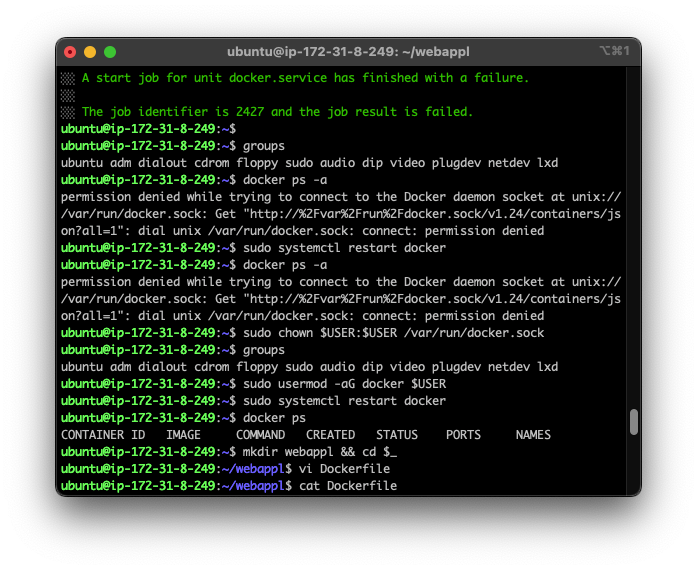
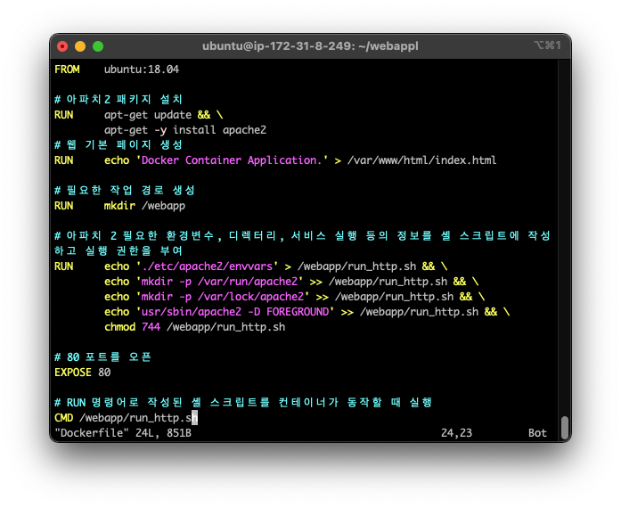
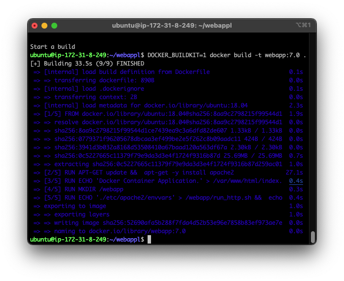
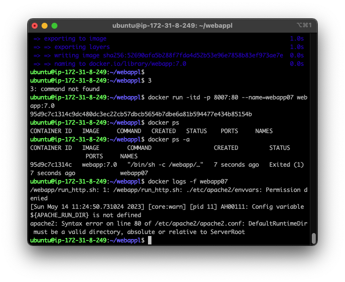
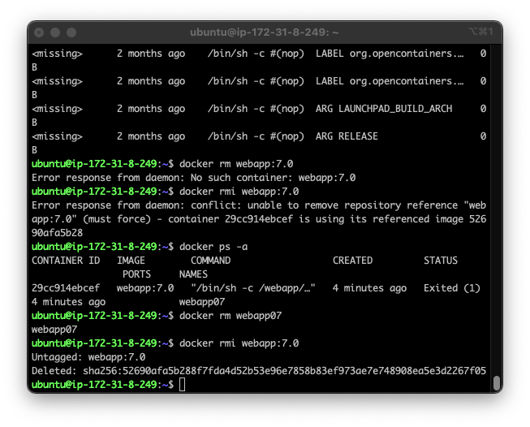

# 4-1

## 폴더 및 도커파일 생성

webapp1 폴더를 생성하고, 그 안에 Dockerfile을 생성한다.

## Dockerfile 작성

아파치2 패키지 설치 및 웹 서버 실행을 위한 Dockerfile을 작성한다. 이때 80번 포트를 열어준다.

## 도커 이미지 빌드

생성한 Dockerfile을 이용하여 도커 이미지를 빌드한다.

## 도커 컨테이너 실행

도커 컨테이너를 실행해야 하는데, 오류가 발생했다. 이유는 아래와 같다.

## 해결방법

이미지를 지웠다. 그리고 다시 빌드하고 실행했다. 그래도 안된다.

