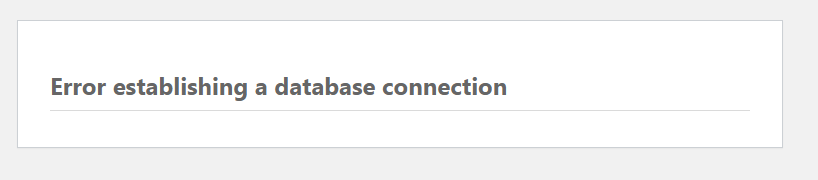
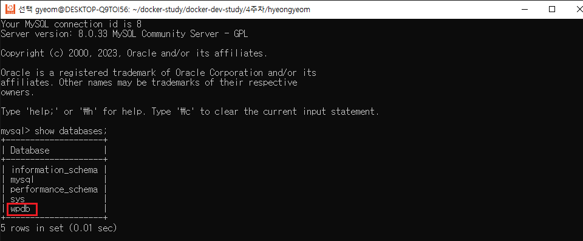
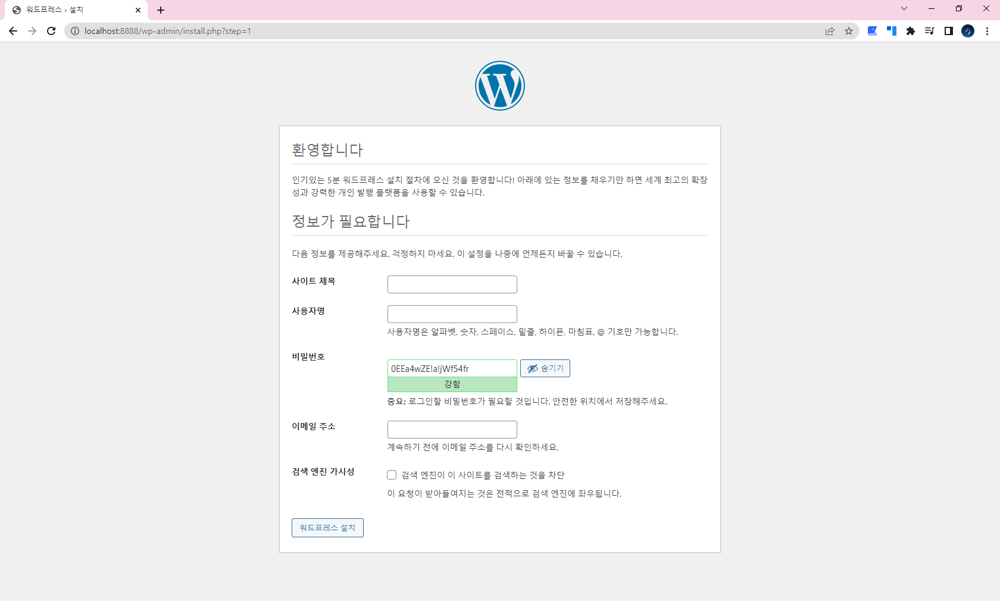
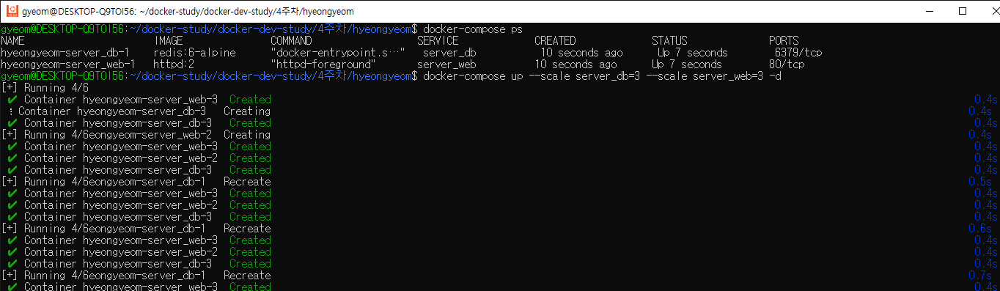
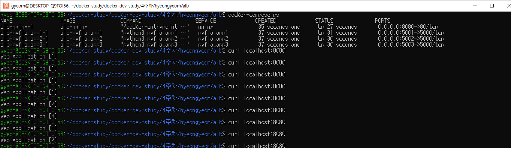

# 5장 도커 컴포즈 도구를 이용한 다중 컨테이너 애플리케이션 서비스 배포

# Docker-compose 활용

도커 컴포즈(docker-compose)는 공통성을 갖는 컨테이너 어플리케이션 스택을 야믈(YAML)코드로 정의하는 정의서이며 그것을 실행하기 위한 다중 컨테이너 실행도구입니다.

특징

1. docker compose up 명령을 수행하면 디렉터리명\_default 이름으로 자체 기본 네트워크가 생성됩니다.
2. 이 기본 네트워크를 통해 IP가 아닌 서비스 명(컨테이너명)으로 통신 가능합니다.
3. docker compose yaml 코드 옵션은 대부분 도커 명령어를 바탕으로 이루어집니다.


## docker-compose yml 파일 작성 및 구동

```yaml
#docker-compose version 정의
version: "3.9"
# docker 서비스 정의
services:
  mydb:
		# 도커 이미지 선택
    image: mysql:8.0
		# 서비스 컨테이너 이름 지정
    container_name: mysql_app
		# 서비스 볼륨 지정
    volumes:
			-mydb_data:/var/lib/mysql
		# 수동 제어를 제외한 컨테이너 종료 시 자동 재시작
    restart: always
		# 포트 포워딩(호스트 포트와 컨테이너 포트 바인드)
    ports:
      - "3306:3306"
		# 네트워크 지정
    networks:
      - backend-net
		# 서비스가 사용할 환경 변수를 지정
    environment:
      MYSQL_ROOT_PASSWORD: ${MYSQL_ROOT_PASSWORD}
      MYSQL_DATABASE: wpuser
      MYSQL_USER: wpuser
      MYSQL_PASSWORD: ${MYSQL_PASSWORD}

    myweb:
			# myweb 서비스가 실행되기 전에 mydb 서비스를 먼저 실행하는 의존성 설정
      depends_on:
        - mydb
      image: wordpress:5.7
      container_name: wordpress_app
      ports:
        - "8888:80"
			# backend-net으로 mydb 서비스와 동일 네트워크로 지정하고,
			# 외부 연결을 위한 네트워크를 위해 frontend-net 지정
			# docker network connect 명령으로 네트워크를 추가하는 것과 같음
      networks:
        - backend-net
        - frontend-net
      volumes:
        - myweb_data:/var/www/html
        - ${PWD}/myweb-log:/var/log \
      restart: always
      environment:
        WORDPRESS_DB_HOST: mydb:3306
        WORDPRESS_DB_USER: wpuser
        WORDPRESS_DB_PASSWORD: ${WORDPRESS_DB_PASSWORD}
        WORDPRESS_DB_NAME: wpdb

#docker-compose up 할 때 생성됨(docker network create와 동일)
networks:
  frontend-net: {}
  backend-net: {}
#docker-compose up 할 때 생성됨(docker volume create와 동일)
volumes:
  mydb_data: {}
  myweb_data: {}
```

**`docker-compose.yml`** 파일의 **`volumes`** 옵션은 도커 볼륨과 바인드 마운트(호스트와의 파일 시스템 경로 연결) 두 가지 방식을 모두 지원합니다.

- 볼륨
  ```yaml
  volumes:
  	<볼륨이름>:<컨테이너경로>
  ```
- 바인드 마운트
  ```yaml
  volumes:
  	<호스트경로>:<컨테이너경로>
  ```

<aside>
💡 docker-compose 캐시 문제

</aside>

위 내용에서 MYSQL_DATABASE 를 wpdb 가 아닌 mydb로 잘못 설정하여 wpdb로 바꾼 후 이미지를 삭제하고 다시 docker-compose up -d 명령어를 실행하였으나 여전히 mydb로 생성되는 문제를 발견하였습니다.

```bash
$ docker-compose build --no-cache
$ **docker-compose up -d --force-recreate
$ docker-compose up -d --build**
```

검색을 해본 결과 위와 같은 방법을 제시 받았으나 여전히 변경사항이 적용되지 않았습니다.



✅ 해결 방법

docker-compose yaml 파일에 정의된 service name, image 를 변경하여 시도했을 때는 변경사항이 정상적으로 반영됐으나 environment 변경만 동작하지 않는 것으로 보아 volume 문제일 수도 있겠다고 판단되어 docker compose yaml 파일에 정의된 **mydb_data** volume 을 삭제하고 재 시도했을 때 변경사항이 반영되었습니다.





## docker-compose 스케일 확장

동시에 들어오는 워크로드가 많아지는 경우 —scale 옵션을 이용해 현재 실행중인 컨테이너 서비스 수를 확장할 수 있다. 확장 후 숫자를 줄이면 축소도 가능하다.

```yaml
version: "3.8"
services:
  server_web:
    image: httpd:2
  server_db:
    image: redis:6-alpine
```

```bash
docker-compose up --scale server_db=3 --scale server_web=3 -d
```




## 어플리케이션 로드밸런스 구성

nginx Dockerfile 및 nginx.conf 파일과 각 flask 예제 코드와 dockerfile을 준비한다.

- nginx setting

```docker
# nginx Dockerfile
FROM nginx
RUN rm /etc/nginx/conf.d/default.conf
COPY nginx.conf /etc/nginx/conf.d/default.conf
```

```
# nginx.conf
upstream web-alb {
    server 172.17.0.1:5001;
    server 172.17.0.1:5002;
    server 172.17.0.1:5003;
}

server {
    location / {
        proxy_pass http://web-alb;
    }
}
```

- python flask setting

```docker
# flask app Dockerfile
FROM python:3
COPY ./requirements.txt /requirements.txt
WORKDIR /
RUN pip install -r requirements.txt
COPY . /
ENTRYPOINT ["python3"]
CMD ["pyfla_app1.py"]
```

```python
# pyfal_app.py
from flask import Flask

app1 = Flask(__name__)

@app1.route('/')
def hello_world():
    return 'Web Application [1]' + '\n'

if __name__ == '__main__':
    app1.run(debug=True, host='0.0.0.0')
```

```
# requirements.txt
Flask==2.0.1
```

- docker-copomse setting

```yaml
# docker-compose.yml
version: "3"
services:
  pyfla_app1:
    build: ./pyfla_app1
    ports:
      - "5001:5000"
  pyfla_app2:
    build: ./pyfla_app2
    ports:
      - "5002:5000"
  pyfla_app3:
    build: ./pyfla_app3
    ports:
      - "5003:5000"
  nginx:
    build: ./nginx_alb
    ports:
      - "8080:80"
    depends_on:
      - pyfla_app1
      - pyfla_app2
      - pyfla_app3
```

각 구성을 마치고 docker-compose up을 통해 실행하면 다음과 같이 nginx.conf 에 작성된 대로 각 port 에서 구동중인 flask 앱에서 반환하는 text 값 ‘web application[1] [2] [3]’ 이 랜덤하게 뜨는 것을 확인할 수 있다.


