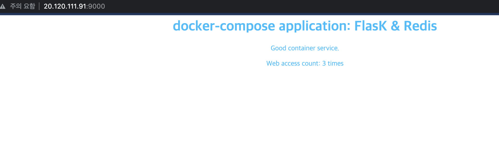
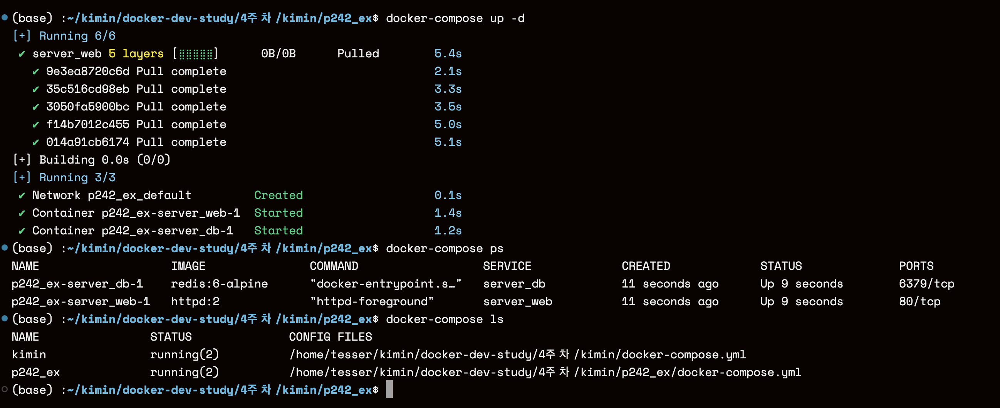
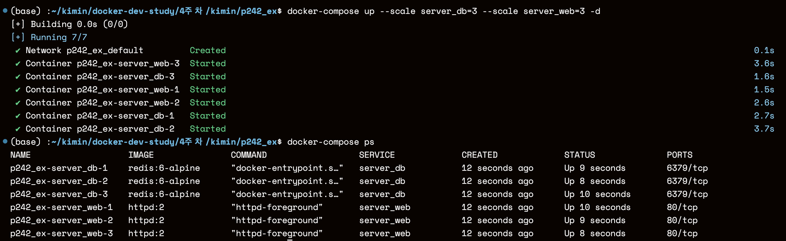

### 1. docker-compose 최신 version 설치
```bash
$ sudo curl -sSL "https://github.com/docker/compose/releases/download/$(curl -s https://api.github.com/repos/docker/compose/releases/latest | grep tag_name | cut -d '"' -f 4)/docker-compose-$(uname -s)-$(uname -m)" -o /usr/local/bin/docker-compose

$ sudo chmod +x /usr/local/bin/docker-compose

$ docker-compose --version
```


### 2. Flask + Redis 사용법 (p)

#### Redis란?


Redis는 데이터베이스, 캐시, 메시지 브로커로 사용할 수 있는 **인메모리 데이터 구조 저장소**입니다. 데이터베이스는 데이터를 물리적 디스크에 저장하기 때문에 서버에 문제가 발생하여 다운되더라도 데이터가 손실되지 않습니다. 그러나 **매번 디스크에 액세스**해야 하기 때문에 사용자가 많아질수록 **부하가 많아져서 느려질 수** 있습니다. Redis는 데이터를 메모리에 저장하기 때문에 **훨씬 빠르게 액세스**할 수 있습니다. 또한 Redis는 데이터를 **쉽게 액세스**할 수 있는 키-값 쌍으로 저장할 수 있습니다.

**Redis는 캐시 서버**로 사용할 수 있습니다. 캐시 서버는 자주 액세스되는 데이터를 메모리에 저장하여 데이터베이스에 대한 액세스 수를 줄이는 데 사용됩니다. 이렇게 하면 데이터베이스의 부하가 줄어들고 **서비스의 속도가 향상**됩니다.

Redis는 **메시지 브로커**로 사용할 수 있습니다. 메시지 브로커는 **애플리케이션 간에 메시지**를 보내는 데 사용됩니다. Redis는 비동기 메시징을 지원하므로 애플리케이션이 서로를 차단하지 않고 메시지를 보낼 수 있습니다.

Redis는 다양한 애플리케이션에 사용할 수 있는 강력한 도구입니다. 빠르고 확장 가능하며 다양한 데이터 구조를 지원합니다.

```yaml
# docker-compose 버전 명시
version: '3.8'

# 사용할 image들 즉, 생성할 컨테이너
services:
  redis:
    # 컨테이너 생성에 사용할 이미지
    image: redis:6-alpine
    # 포트포워딩 ( -p )
    ports:
      - 6379:6379
    # 컨테이너가 종료되도 계속 실행
    restart: always
  flask:
    # Dockerfile build 옵션
    build: 
      # 사용할 Dockerfile위치
      context: ./
      # 사용할 Dockerfile이름
      dockerfile: Dockerfile
    ports:
      - 9000:9000
    # redis부터 실행하고 flask를 이어서 실행
    depends_on:
      - redis
    restart: always

```


- docker-compose v2.18.1 (latest)를 설치했는데, version은 3.8이 최대인 것 같음

  ```text
   Compose 파일 버전은 Compose 프로그램이 업데이트 되어도 매번 새로운 버전이 나오지는 않아요. 예를 들어, Compose 파일 버전 3.0은 Compose 프로그램 1.10.0에서 처음 소개되었고, 이후에 새로운 업데이트가 있을 때마다 점차적으로 업그레이드되었습니다.
  
  그리고 가장 최신 버전의 Compose 파일 형식은 Compose Specification에 정의되어 있으며, Docker Compose 1.27.0 이상에서 구현됩니다.
  ```

  

#### 결과



- 정상적으로 카운트 되는 모습을 확인할 수 있음
- Redis를 사용하면 첫번째 access 타임에만 빌드 시간이 오래 걸리고, 이후 타임에는 빠르게 로드할 수 있을 것 같음
- 온톨 3D의 경우에도 gif 파일의 로드 시간이 오래 걸리는데, 캐시로 저장해두면 빨라질 수 있음


### 3. 실습 (p242)



- docker-compose up -d를 수행한 후 ps로 실행되어 있는 프로세스를 NAME을 보면, 폴더명과 서비스 명이 합쳐져 있다. 
- docker-compose ls를 하면, 해당 폴더에서 실행된 프로세스 뿐만 아니라, 다른 compose 실행 내용도 보임

**컨테이너 서비스 수 3개씩 확장**

```bash
docker-compose up --scale server_db=3 --scale server_web=3 -d
```



- 프로세스가 각각 3개씩 켜져있는 모습을 확인할 수 있다. 
- 동시 요청이 들어오는 경우 컨테이너를 여러개 실행하여 유연하게 사용이 가능하다. 