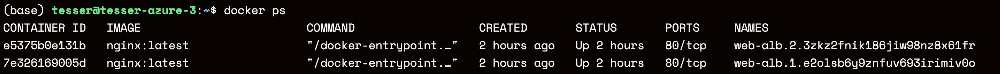

## 1. Docker Swarm Init

`docker system info` 명령어를 사용하여 현재 swarm 모드가 실행되었는지 확인할 수 있습니다. 


- 현재 inactive 되어있는 상태이므로 아래 명령어로 swarm 모드를 활성화합니다. 

```bash
docker swarm init
```


- 명령어를 실행하게 되면 위와 같이 manager가 생성되는 모습을 확인할 수 있습니다.


## 2. Docker Swarm Monitoring

- 책에서는 모니터링을 위해 도커 스웜피트를 제안했지만, 간단한 통합 모니터링을 위해 Portainer를 사용했습니다. 

```bash
docker container run -d \
--restart always \
-p 9000:9000 \
-v /var/run/docker.sock:/var/run/docker.sock \
--name portainer \
portainer/portainer
```


- 정상적으로 연결되었음을 확인할 수 있습니다.


## 3. Docker Swarm Worker 연결


- manager에서 token 생성 후 worker에서 조인합니다. 
- 이때 2377 포트로 연결을 진행해야 되기 때문에, 아래와 같이 명령어를 수정해서 연결합니다. 

```bash
# Manager node로 사용할 VM에서 초기화 진행
docker swarm init

# Worker node로 사용할 VM에서 아래 명령어 기입
docker swarm join --token SWARM_TOKEN <MANAGER_IP>:2377
```


- 정상적으로 worker가 설정된 모습을 확인할 수 있습니다. 


## 4. nginx를 이용한 서비스 컨테이너 배포와 관리

- manager와 worker 노드 구성이 완료되면, manager node에서 worker 노드에 서비스를 배포할 수 있다. 
- 다음 명령어를 통해 nginx 2개의 서비스를 배포한다. 

```bash
docker service create \ 
--name web-alb \
--constraint node.role==worker \
--replicas 2 \
-publish 8001:80 \
nginx
```

**Manager Node 환경**


**Worker Node 환경**



**Cluster Visualization**


## 5. 진행 중 이슈 정리

- Azure VM에서 network 주소 변경 시 연결이 끊김
  - sudo ifconfig eth0을 192.168.56.100으로 변경했더니 접속 종료
- A.3.1(347p)에서 worker에 서비스가 생성되지만,  manager 노드에서 8001번에 연결(listen)이 안되어 있음

