# 부록 도커 스웜 모드 클러스터 활용

# 부록

## 도커 스웜이란?

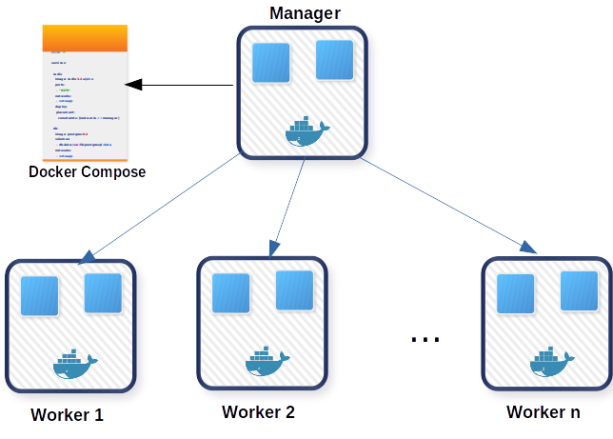

도커 스웜(Docker Swarm)은 도커(Docker)를 사용하여 컨테이너화된 애플리케이션을 관리하기 위한 **오케스트레이션(Orchestration) 도구**입니다. 스웜은 여러 개의 도커 호스트를 클러스터로 구성하여 애플리케이션을 분산하여 실행하고 관리할 수 있게 해줍니다.

도커 스웜은 컨테이너화된 애플리케이션을 여러 개의 도커 호스트에 분산 배치하여 확장성과 가용성을 높일 수 있습니다. 스웜 클러스터에는 **매니저 노드**(Manager Node)와 **워커 노드**(Worker Node)로 구성됩니다. 매니저 노드는 스웜 클러스터의 상태를 관리하고 작업(Task)을 스케줄링하며, 워커 노드는 컨테이너를 실행하는 역할을 수행합니다.

도커 스웜은 서비스(Service)라는 개념을 제공하여 애플리케이션을 도커 컨테이너로 실행하고 관리할 수 있습니다. 서비스는 컨테이너화된 애플리케이션의 복제본을 유지하며, 필요에 따라 자동으로 복제본을 확장하거나 축소할 수 있습니다. 또한, 스웜은 로드 밸런싱(Load Balancing)을 지원하여 여러 개의 워커 노드에 걸쳐 애플리케이션 트래픽을 분산시킬 수 있습니다.

도커 스웜은 도커 엔진과 통합되어 사용할 수 있으며, 도커 CLI(Command Line Interface)를 통해 스웜 클러스터를 관리할 수 있습니다. 스웜은 여러 호스트에서 컨테이너를 관리하기 때문에 애플리케이션의 가용성과 확장성을 향상시키는 데 도움이 됩니다.

## Ingress 네트워크

Ingress 네트워크는 도커 스웜 클러스터를 생성하면 자동으로 생성되는 네트워크입니다. 스웜 클러스터에 노드가 추가되면 해당 노드는 자동으로 해당 클러스터의 Ingress 네트워크에 등록됩니다.

Ingress 네트워크는 클러스터 외부에서 애플리케이션에 접근하기 위한 프록시 역할을 수행합니다.

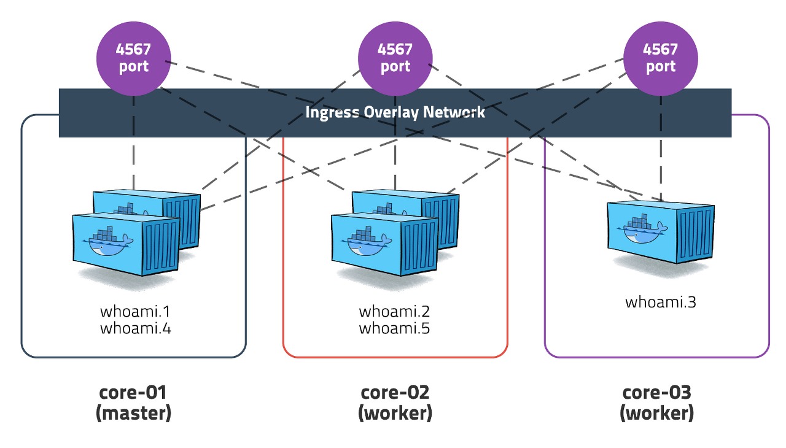


도커 스웜 클러스터에 연결된 노드들은 Ingress 네트워크 안에서 통신되며, 서로 연결되어 있습니다.

예를들어 서비스에서 포트를 오픈하면, 모든 노드에서 포트가 오픈되고 어떤 노드에 요청을 보내도 실행 중인 컨테이너에 자동으로 전달됩니다. 위처럼, whoami 서비스로 4567포트를 오픈 했을 때 3개의 노드 모두 4567 포트가 오픈됩니다. 외부에서 해당 서비스에 접속할 때, 어떤 노드를 통해서 접속하든 5개의 컨테이너 중 하나로 분산처리됩니다.

또한, Ingress 네트워크는 각 노드에 내장되어있는 로드 밸런서를 통해 서비스내의 컨테이너들 간에 **라운드 로빈(round-robin)** 방식으로 로드 밸런싱을 수행합니다.

이 로드 밸런서에는 **routing mesh**라는 기능이 있는데 이는 노드에 실행중인 서비스가 없더라도 Ingress 네트워크에서 실행되고 있는 모든 서비스에 대한 포트를 오픈하여 각 노드의 로드 밸런서를 모든 컨테이너와 연결시켜주는 기능입니다.

## 도커 스웜  연결

1. `docker system info` 명령어를 통해 docker swarm 모드 상태를 확인할 수 있습니다.
    
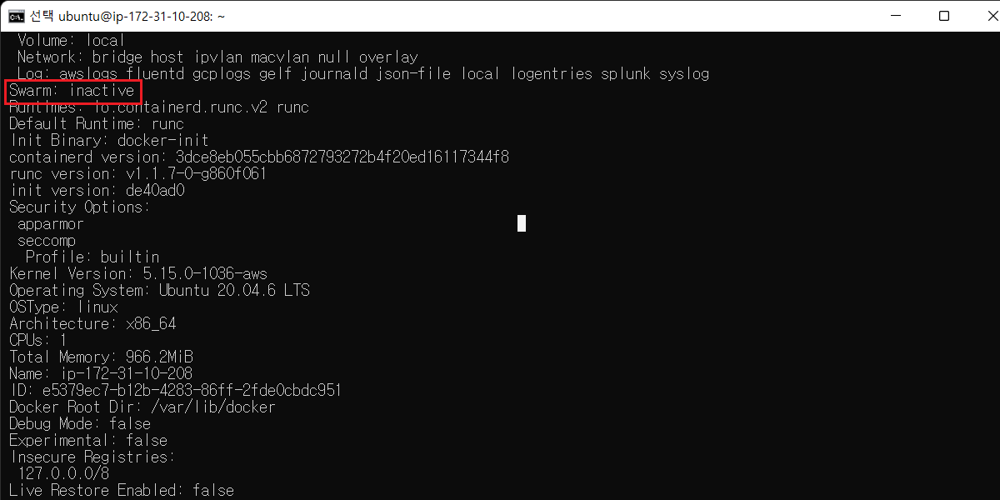

    

2. `docker warm init [옵션]` 명령을 통해 도커 스웜 초기화를 수행하고 `docker node ls` 명령어를 통해 node 상태를 확인할 수 있습니다.
    
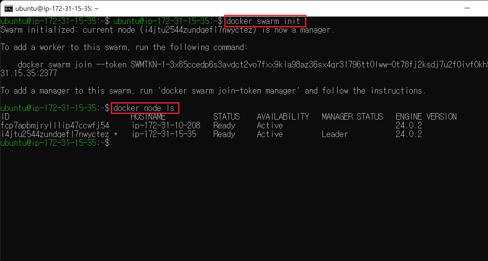

    
3. 위 docker swarm init 명령어를 통해 생성된 명령어  `docker swarm join --token SWARM_TOKEN <MANAGER_IP>:2377` 를 그대로 워커로 설정할 노드에 따라 치거나 복사 붙여넣기 합니다.
    
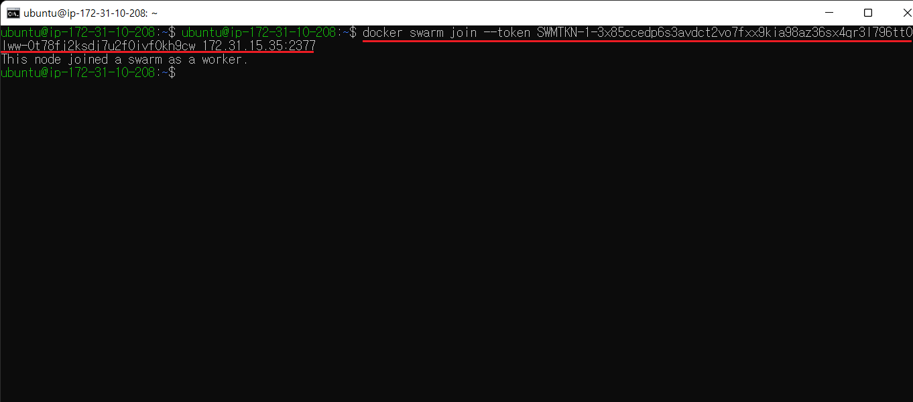
    

4. 간단하게 도커 스웜 클러스터에 매니저 노드와 워커 노드 연결을 설정하였습니다. 이는 Docker Web 관리 Tool ****portainer를 통해 시각적으로 확인할 수 있습니다.

```bash
docker container run -d \
--restart always \
-p 9000:9000 \
-v /var/run/docker.sock:/var/run/docker.sock \
--name portainer \
portainer/portainer
```

- 1개의 매니저 노드와 2개의 워커 노드를 확인할 수 있습니다.

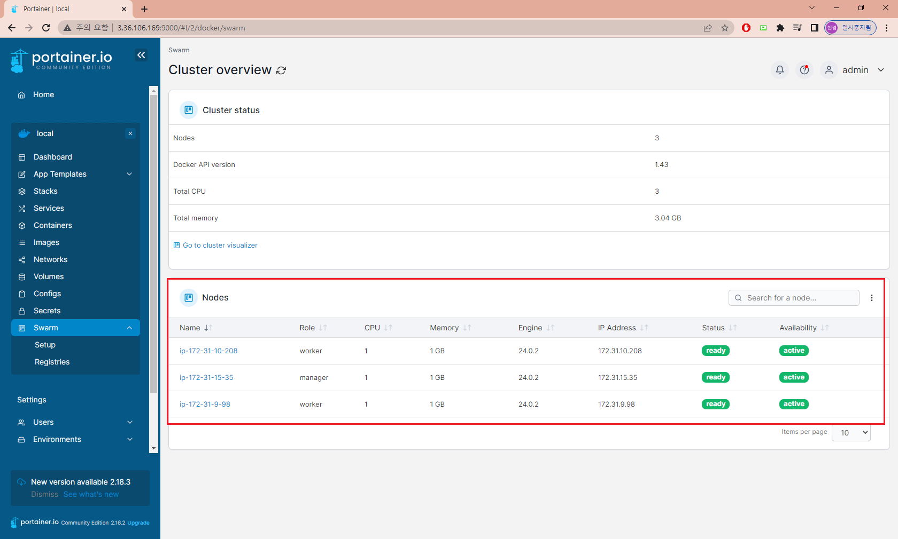


## 도커 스웜 로드밸런싱

1. nignx를 2개의 복제본으로 클러스터 노드에 배포합니다.

```bash
docker service create \
--name web-alb \
--constraint node.role==worker \
--replicas 2 \
--publish 8001:80 \
nginx
```

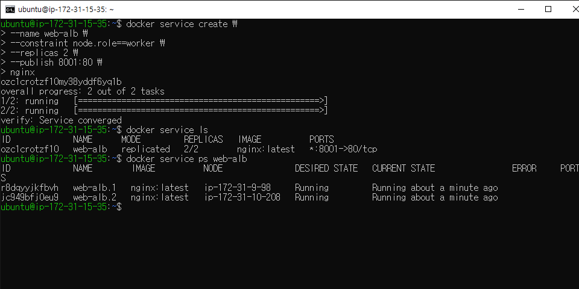


2. 각 노드에서 docker ps 명령어를 통해 nignx 컨테이너가 잘 생성되었는지 확인합니다.

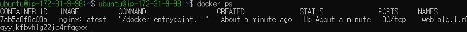


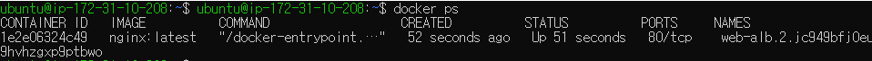


3. 각 노드에 index.html 을 만들고 nignx 컨테이너 index.html 파일 경로에 복사합니다.

`docker cp index.html <container name>:/usr/share/nginx/html/index.html`

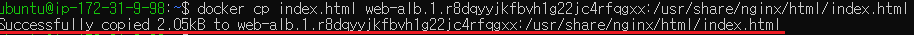


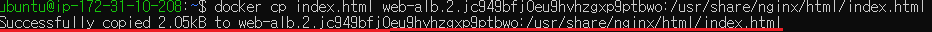


4. 클러스터의 어떤 노드에서든 아래와 같이 조회를 수행해 보면 배포된 서비스 컨테이너에 로드 밸런싱으로 교차 접근하는 것을 확인할 수 있습니다.

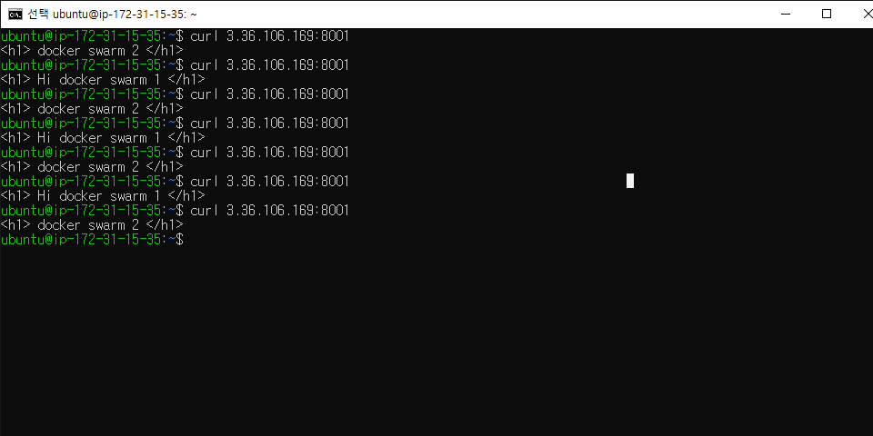
