## 1. Azure로 프로젝트 구성하기

#### 첫 번째, 사전 작업

1. Docker를 사용할 VM 배포
2. 내부에 Azure CLI, Docker 설치

### VM 환경 구성하기

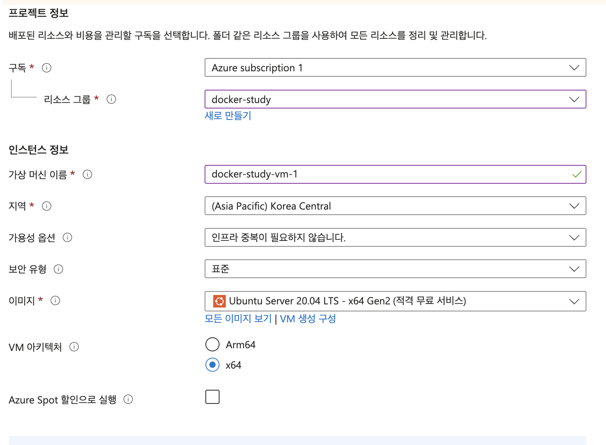

- Docker 이미지를 올려서 배포할 VM을 생성합니다. 
- 사양: Standard B1s(1개 vcpu, 1GiB 메모리)

- Docker 설치

  ```bash
  wget -qO- https://get.docker.com | sh -
  ```

  

- Azure Cli 설치

  ```bash
  sudo apt install azure-cli
  ```

  

### ContainerRegistry에 이미지 올리기

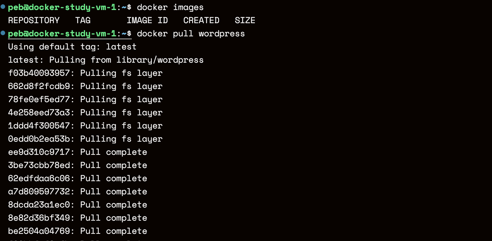

- 실습을 위해 워드프레스 이미지를 다운 받습니다.

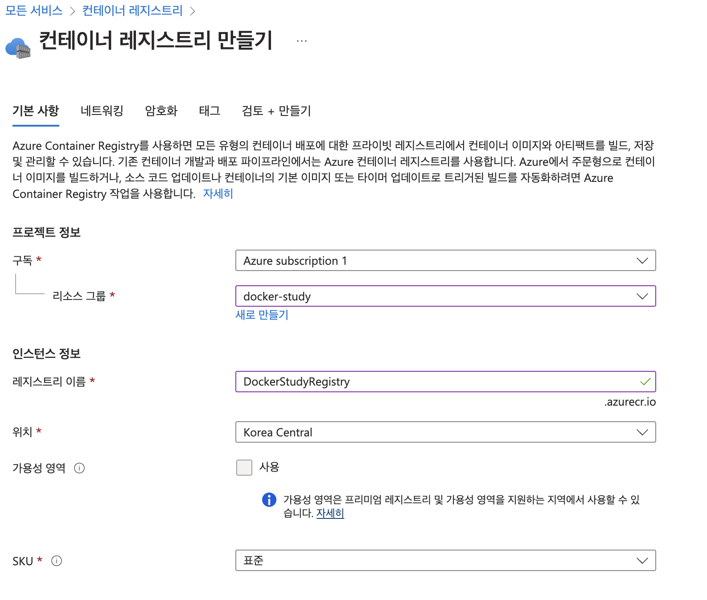

- 그 후 Azure Container Registry(ACR)을 만들어줍니다. (ECR과 같은 역할)

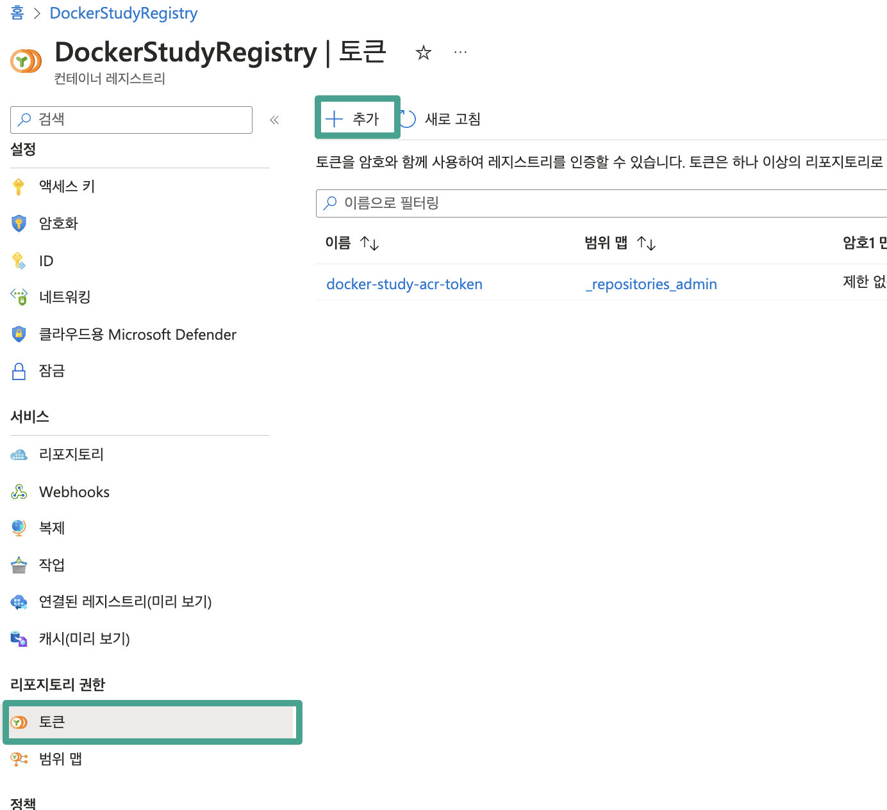

- ACR에 접속하기 위한 토큰을 발급해줍니다.

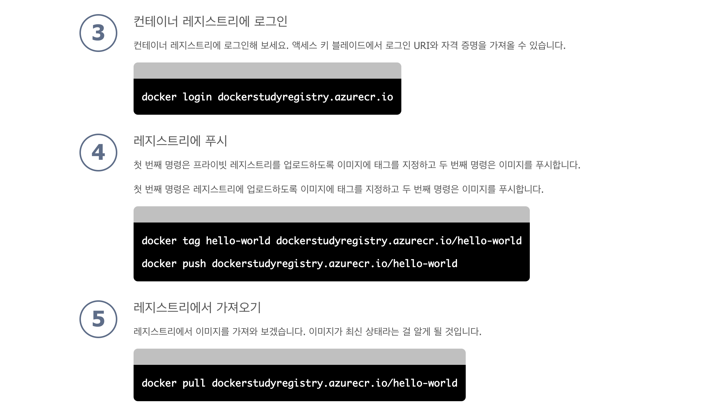

- 빠른 시작에서 제공하는 설명을 참고하여 도커 레지스트리를 세팅합니다.
- 3번의 경우 위에서 발급 받은 토큰 정보를 활용하여 로그인합니다.

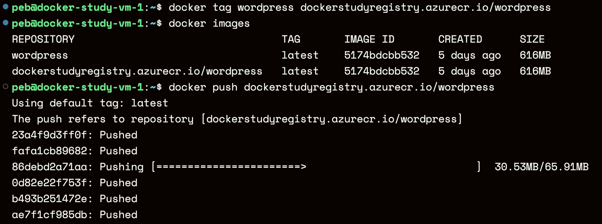

- 위의 명령어를 활용하여 기본 이미지를 ACR로 push하기 위한 tag로 변경해줍니다.
- 이후 해당 이미지를 push 하면 Azure에서 만든 레지스트리로 업로드 됩니다.

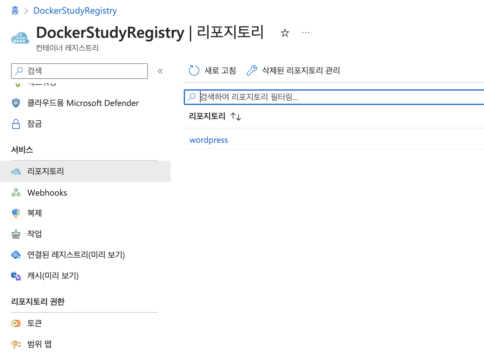

- ACR의 리포지토리를 확인하면 wordpress가 정상적으로 올라갔음을 확인할 수 있습니다.

### VPN 만들기


- 이름: docker-study-vpn-1
- 게이트웨이 SKU: VpnGw2AZ
- 서브넷 주소 범위: GatewaySubnet(10.0.1.0/24)
- 첫 번째 공용 IP 주소: 20.39.194.253(docker-study-ip-1)
- 두 번째 공용 IP 주소: 20.39.192.119(docker-study-ip-2)

### 라우트 테이블 생성

Azure는 AWS처럼 별도로 인터넷 게이트웨이(IGW)를 잡아 주지 않아도 **외부와 네트워크**가 된다.
Azure는 라우팅 테이블로 Public , Private로 구분하지 않으며, 방화벽으로 네트워크 보안 관리를 한다.

AWS는 라우팅 테이블로 Public , Private로 구분한다.

### Container Apps 생성 (feat.ECS) 


- Azure Container Apps(ACA)을 선택합니다. 

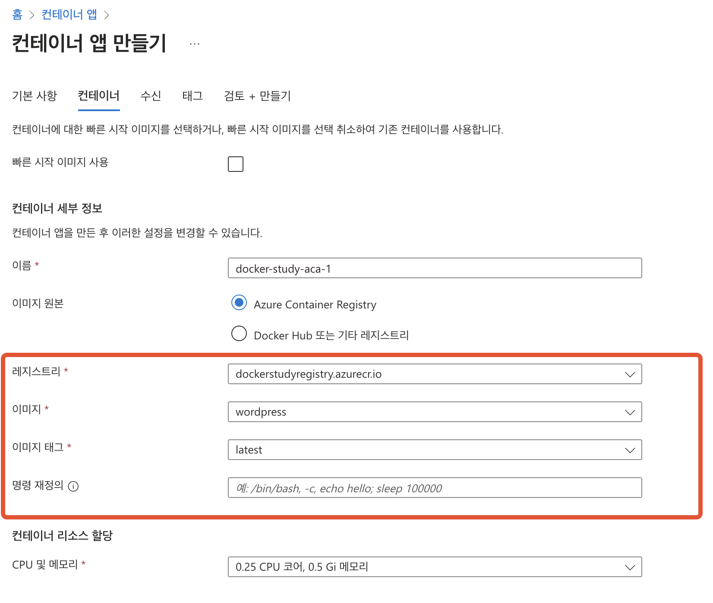

- 컨테이너 앱을 만들 때 이미 생성된 ACR을 선택해줍니다. 

#### 이슈 해결

- 처음 ACR을 선택하면 `ACR의 관리자 자격 증명을 사용할 수 없으므로 ACR 에 액세스할 수 없습니다.`라는 오류가 발생한다. 
- 이는 관리자 자격 증명을 설정하지 않을 때 나타나는 오류이므로 [해당 링크](https://learn.microsoft.com/ko-kr/azure/container-registry/tutorial-enable-customer-managed-keys)를 참고하여 관리자 자격 증명을 생성한다. 

```bash
# 1. azure cli 로그인
$ az login

# 2. identity group 생성
$ az identity create   --resource-group <resource-group-name> --name <managed-identity-name>
```

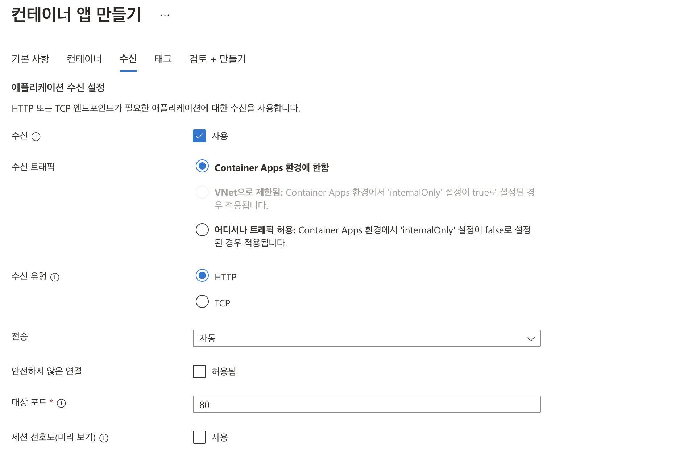

- 처음 설정할 때 포트 80에 대한 HTTP 수신설정도 가능합니다. 
- 위에서 Container APPs로 설정하면 환경이 제한되기 때문에 이후 `어디서나 트래픽 허용`으로 바꿨습니다. 

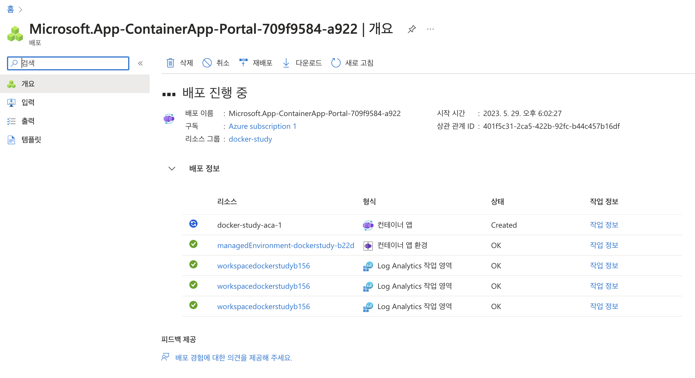

- 배포가 성공적으로 진행중임을 확인할 수 있습니다.

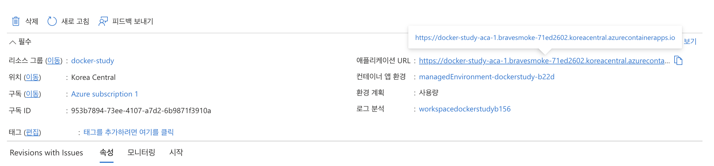

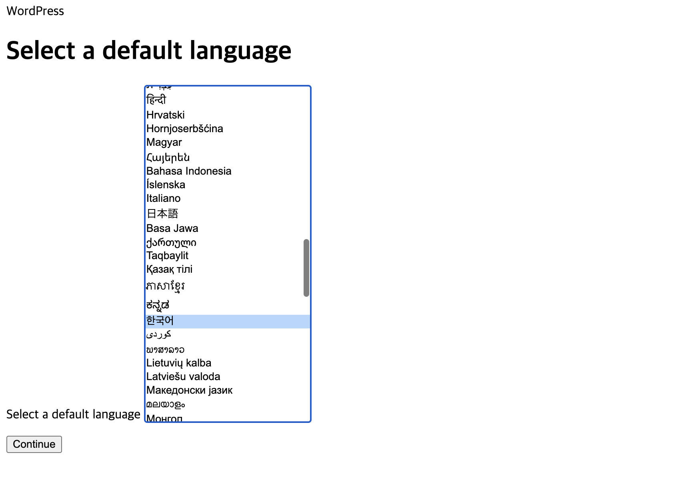

- 컨테이너 앱에 있는 애플리케이션 URL로 접속하면 성공적으로 워드프레스 페이지가 확인됩니다.

### Private DNS Zone 생성

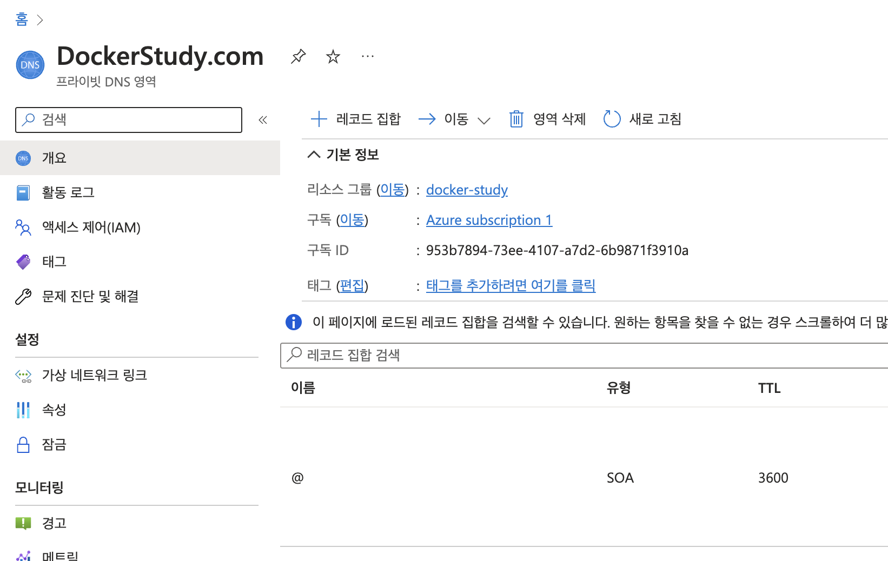

- VPN 연결을 위한 준비를 위해 DNS를 생성합니다. 

### 가상 네트워크 링크

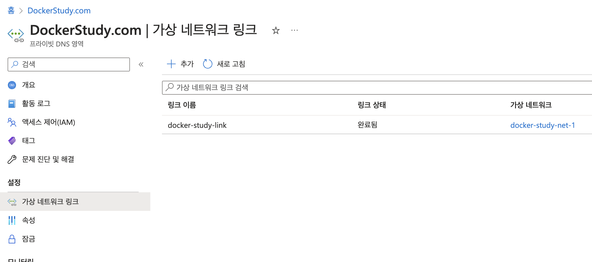