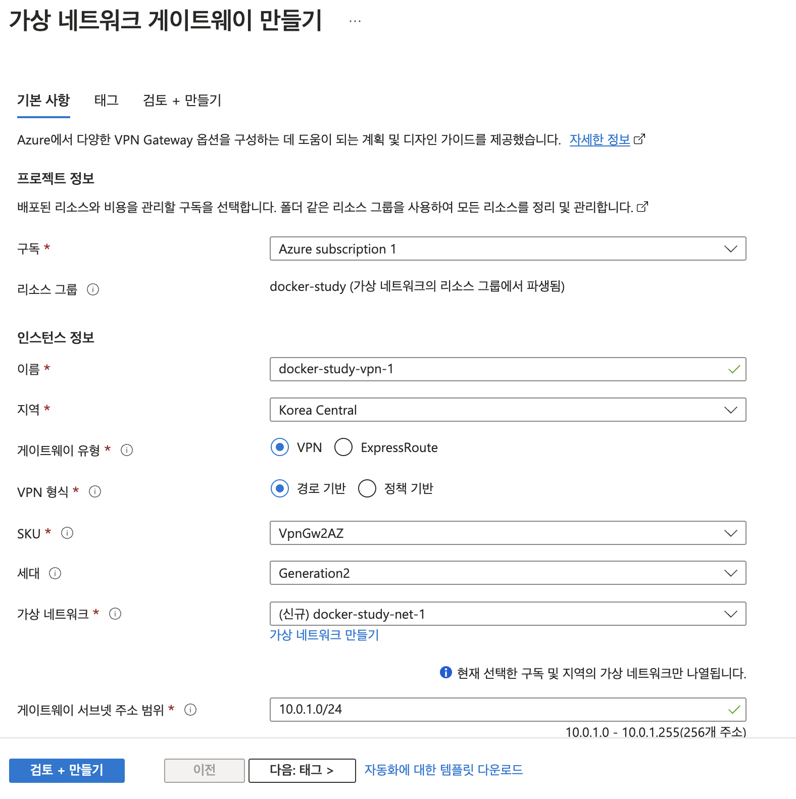
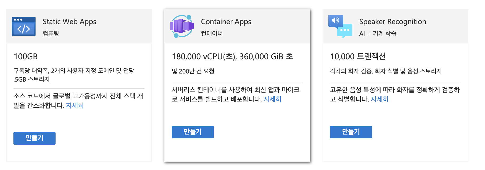

## 1. Azure로 프로젝트 구성하기

### VPN 만들기

- 이름: docker-study-vpn-1
- 게이트웨이 SKU: VpnGw2AZ
- 서브넷 주소 범위: GatewaySubnet(10.0.1.0/24)
- 첫 번째 공용 IP 주소: 20.39.194.253(docker-study-ip-1)
- 두 번째 공용 IP 주소: 20.39.192.119(docker-study-ip-2)

### 라우트 테이블 생성

TBD

### Container Apps 생성 (feat.ECS) 

- Container Apps 선택

