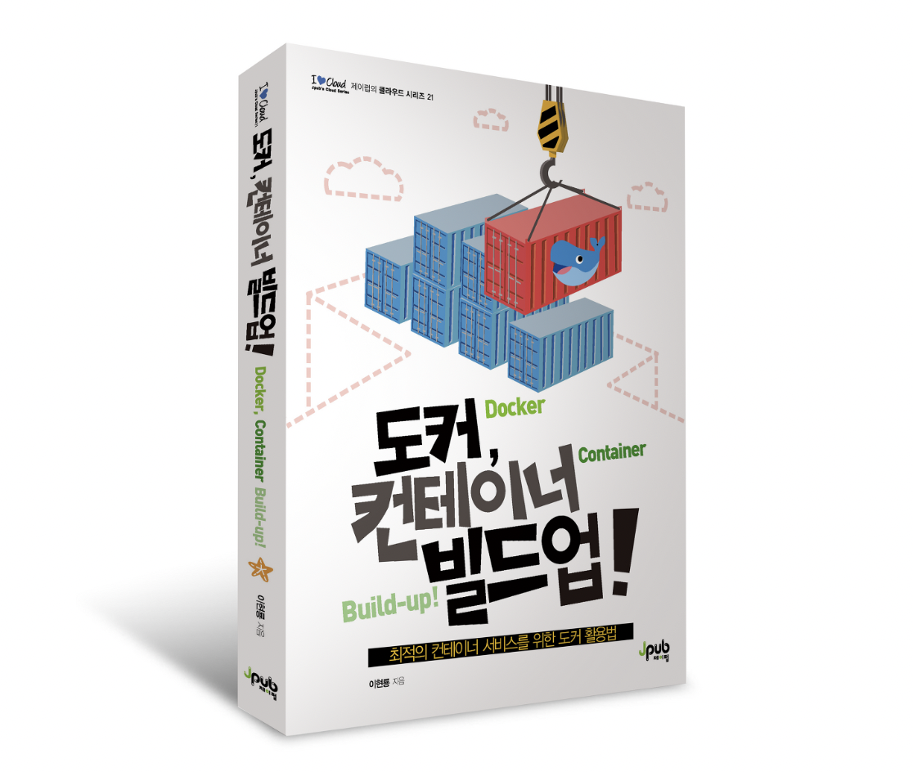

## 사내 도커 스터디
안녕하세요!:smile: 사내 도커, 컨테이너 실력 향상을 위한 스터디 저장소입니다.        

​      

### :heavy_check_mark: 매주 스터디 전날까지
### :heavy_check_mark: 참여 방법
****

1. 주차별로 **branch**를 생성한다. (ex. week1/kimin)
2. **Markdown** 파일 형식으로 본인의 스터디 내용을 정리한다. 
   1. 실습 문제를 최소 **3개 이상** 풀어서 결과와 내용을 정리한다. 
   2. *.yaml, *.sh 등 실습의 산출물을 자유롭게 commit 한다.

3. 주차별로 이미 생성된 폴더에 자신의 **스터디 정리 내용을 업로드** 한다. 
4. main branch로 **Pull Request**를 한다. 

### :pushpin: 주차별 내용

| 주차  | 주제                                                         | 모임일   | 상태 |
| ----- | ------------------------------------------------------------ | -------- | ---- |
| 1주차 | OT: 도커 스터디 일정 및 방향 결정                            | 23.04.28 | 완료 |
| 2주차 | 3장: 컨테이너 서비스를 위한 도커 활용                        | 23.05.04 | 예정 |
| 3주차 | 4장: 컨테이너 환경 구성을 위한 Dockerfile 구성               |          | 예정 |
| 4주차 | 5장: 도커 컴포즈 도구를 이용한 다중 컨테이너 애플리케이션 서비스 배포 |          | 예정 |
| 5주차 | 6장: AWS 클라우드를 활용한 컨테이너 서비스 배포              |          | 예정 |

### :sparkles: 멤버
***

|   김태훈  |   박기민   |   이택영   |  최현겸    |
| ---- | ---- | ---- | ---- |
| [thisistaehun](https://github.com/thisistaehun) | [PEBpung](https://github.com/PEBpung) | [ltyiz07](https://github.com/ltyiz07) | [h-gyeom](https://github.com/h-gyeom) |